# 🚀 Smart Money Bot: AI 기반 종가 베팅 & VCP 시그널 시스템

**🌐 데모 페이지 (Live Demo)**: [https://close.highvalue.kr](https://close.highvalue.kr)

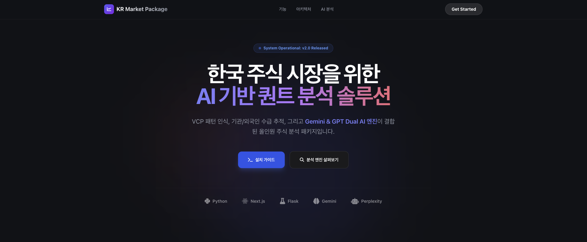

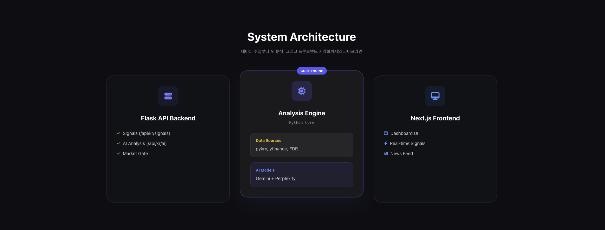

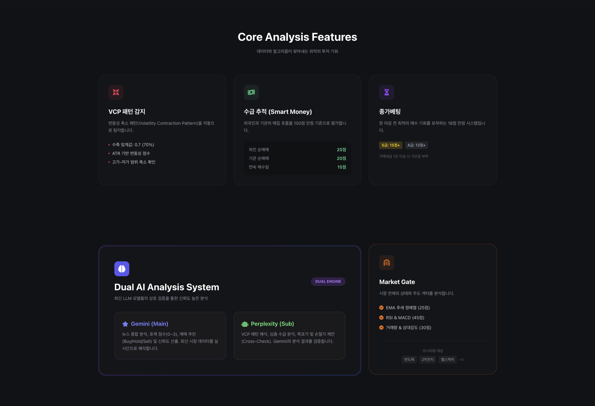

---

## 🎯 핵심 가치 제안

- **Rule-based Screening + AI Reasoning**: 엄격한 기술적 필터링과 AI의 맥락 이해력을 결합하여 신호 품질을 극대화
- **Multi-Model AI Cross-Validation**: 세 가지 모델(Gemini, GPT, Perplexity)을 조화롭게 운용하여 분석 신뢰도 극대화
- **Market-First Approach**: 개별 종목 분석 전에 시장 상태를 먼저 판단하여 하락장 리스크 사전 차단
- **Real-time Multi-Channel Notification**: Telegram, Discord, Slack, Email로 분석 결과를 즉시 전달

 ### 1. Market-First Philosophy (시장 우선주의)
> *"시장을 이기는 종목은 없다."*
- 개별 종목 분석 이전에 **Market Gate(시장 신호등)** 가 시장의 건전성을 먼저 판단합니다.
- 환율, 수급, 기술적 지표가 위험 수준일 경우, 아무리 좋은 종목이 포착되어도 매수를 **원천 차단(Gate Closed)** 하여 계좌를 보호합니다.        

### 2. Rule-based Screening + AI Reasoning (하이브리드 분석)
- **1차 후보군 필터(Rule)**: `get_top_gainers` 단계에서 **거래대금 10억 이상 + 등락률 하한(`MIN_CHANGE_PCT`, 기본 0%)** 조건으로 후보를 압축합니다.
- **2차 필터(AI)**: 선별된 종목의 뉴스와 재료를 AI가 정성적으로 분석하여 "가짜 반등"과 "진짜 호재"를 구분합니다.  

### 3. Multi-Model AI Cross-Validation (이중 검증)
- **Gemini**: 긴 문맥(Context) 이해와 심층 추론을 담당하여 상세한 투자 리포트를 작성합니다.
- **GPT/Perplexity**: VCP 분석에서는 `VCP_SECOND_PROVIDER` 설정에 따라 Gemini의 보조 검증 모델로 동작합니다.

---

## 🚀 빠른 시작 (Quick Start)

### 1. 서버 시작 (가장 빠른 방법)

`restart_all.sh` 스크립트가 자동으로 환경 설정, 패키지 설치, 서버 실행을 처리합니다.

```bash
./restart_all.sh
```

이 스크립트는 다음 작업을 자동으로 수행합니다:
- ✅ 가상환경(venv) 자동 생성 및 패키지 설치
- ✅ 프론트엔드 의존성 설치 (npm install)
- ✅ 기존 프로세스 자동 종료
- ✅ 백엔드(Gunicorn)과 프론트엔드(Next.js) 동시 시작
- ✅ .env 설정 자동 로드 및 포트 적용

**서버 접속:**
- 백엔드: http://localhost:5501
- 프론트엔드: http://localhost:3500

### 2. API 키 설정 (.env)

루트 디렉토리의 `.env` 파일에 API 키를 설정합니다.

```env
# 서버 포트 설정
FRONTEND_PORT=3500
FLASK_PORT=5501
FLASK_HOST=0.0.0.0

# AI API 키 (필수)
GOOGLE_API_KEY=your_gemini_key_here
OPENAI_API_KEY=your_openai_key_here
PERPLEXITY_API_KEY=your_perplexity_key_here

# 선택사항 (Z.ai 통한 GPT)
ZAI_API_KEY=your_zai_key_here

# VCP AI 설정
VCP_AI_PROVIDERS=gemini,gpt
VCP_SECOND_PROVIDER=gpt         # gpt 또는 perplexity 중 1개 선택
VCP_GEMINI_MODEL=gemini-2.0-flash
VCP_GPT_MODEL=gpt-5-nano
VCP_PERPLEXITY_MODEL=sonar

# 스케줄러 시간 설정 (KST)
CLOSING_SCHEDULE_TIME=16:00
MARKET_GATE_UPDATE_INTERVAL_MINUTES=30

# 스케줄러 활성화
SCHEDULER_ENABLED=true
```

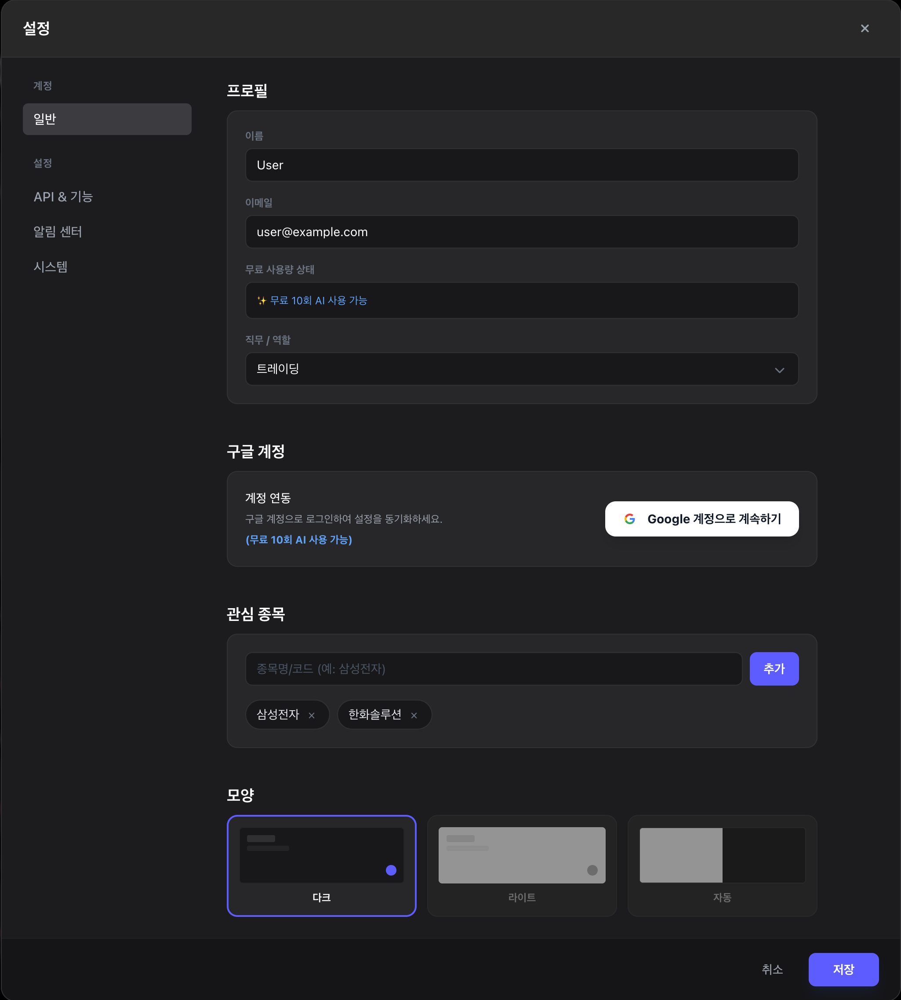
*사용자 설정 및 API 키 관리 화면*

### 3. 서버 실행 및 중지
새로 통합된 `restart_all.sh` 스크립트를 사용하여 백엔드와 프론트엔드를 한 번에 관리할 수 있습니다.

- **서버 시작/재시작**:
  ```bash
  ./restart_all.sh
  ```
  *(기존 프로세스를 자동으로 종료하고 `.env` 설정에 따라 새 포트로 서버를 띄웁니다.)*

- **서버 중지**:
  새로 추가된 `stop_all.sh` 스크립트를 사용하여 모든 서비스를 안전하게 종료할 수 있습니다.
  ```bash
  ./stop_all.sh
  ```
  *(수동 종료 시에는 `lsof -ti :5501,3500 | xargs kill -9` 등을 활용하세요.)*

- **로그 확인**:
  ```bash
  tail -f logs/backend.log logs/frontend.log
  ```
---

## 🏗 시스템 아키텍처

이 프로젝트는 정교한 데이터 파이프라인과 AI 추론 엔진이 결합된 **하이브리드 아키텍처**를 따릅니다.

### 전체 시스템 흐름도

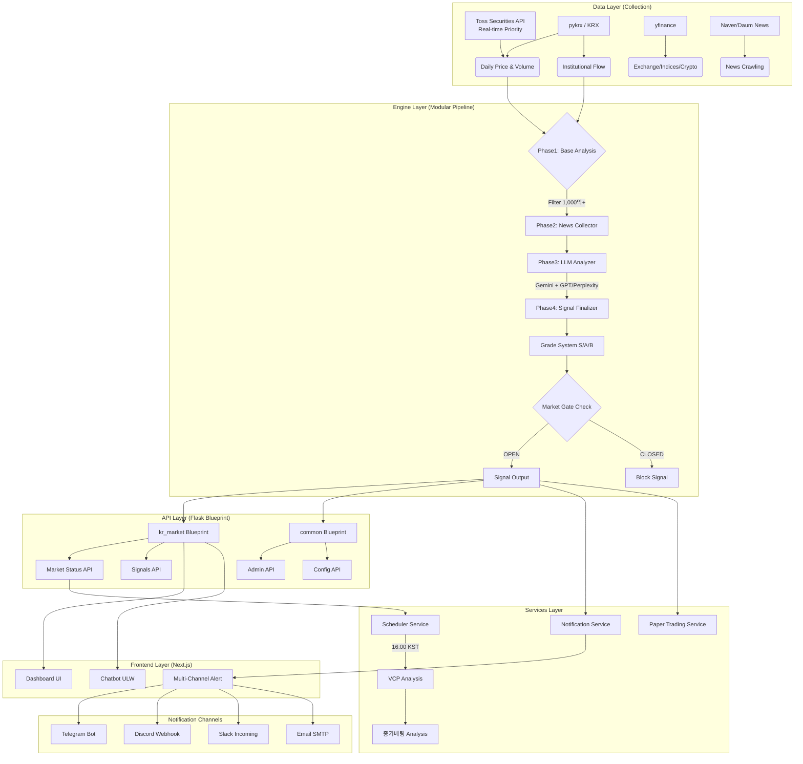
```mermaid
graph TD
    subgraph "Data Layer (Collection)"
        A[Toss Securities API<br>Real-time Priority] --> B(Daily Price & Volume)
        C[pykrx / KRX] --> B
        C --> D(Institutional Flow)
        E[yfinance] --> F(Exchange/Indices/Crypto)
        G[Naver/Daum News] --> H(News Crawling)
    end

    subgraph "Engine Layer (Modular Pipeline)"
        B & D --> I{Phase1: Base Analysis}
        I -->|Filter 1,000억+| J[Phase2: News Collector]
        J --> K[Phase3: LLM Analyzer]
        K -->|Gemini + GPT/Perplexity| L[Phase4: Signal Finalizer]
        L --> M[Grade System S/A/B]

        M --> N{Market Gate Check}
        N -->|OPEN| O[Signal Output]
        N -->|CLOSED| P[Block Signal]
    end

    subgraph "API Layer (Flask Blueprint)"
        O --> Q[kr_market Blueprint]
        O --> R[common Blueprint]
        Q --> S[Market Status API]
        Q --> T[Signals API]
        R --> U[Admin API]
        R --> V[Config API]
    end

    subgraph "Services Layer"
        S --> W[Scheduler Service]
        O --> X[Notification Service]
        O --> Y[Paper Trading Service]
        W -->|16:00 KST| AA[VCP Analysis]
        AA --> Z[종가베팅 Analysis]
    end

    subgraph "Frontend Layer (Next.js)"
        Q --> AB[Dashboard UI]
        Q --> AC[Chatbot ULW]
        X --> AD[Multi-Channel Alert]
    end

    subgraph "Notification Channels"
        AD --> AE[Telegram Bot]
        AD --> AF[Discord Webhook]
        AD --> AG[Slack Incoming]
        AD --> AH[Email SMTP]
    end
```

### AI-First 아키텍처 설계 원칙

**왜 이 아키텍처를 선택했는가?**

| 설계 원칙                       | 적용 방식                                                | 이유                                            |
| ------------------------------- | -------------------------------------------------------- | ----------------------------------------------- |
| **Multi-Model AI Verification** | Gemini + 설정된 보조모델(GPT 또는 Perplexity) 병렬 실행  | 단일 모델의 편향성(bias) 완화, 신호 신뢰도 상승 |
| **Async Batch Processing**      | `asyncio` + `Semaphore`로 환경변수 기반 동시성 제어       | API 호출 시간 최적화, Rate Limit 방지           |
| **Market Gate Pattern**         | 개별 종목 분석 전 시장 전체 상태 먼저 점검               | 하락장에서의 무분별한 매수 방지, 계좌 보호      |
| **Chain Execution Pattern**     | 데이터 수집 → VCP 분석 → AI 종가베팅 순차 실행           | 데이터 정합성 보장 및 분석 단계별 의존성 해결   |
| **Persona-Based Prompting**     | 일관된 투자 철학(스마트머니봇)을 시스템 프롬프트에 탑재  | AI 응답의 편차 최소화, 신뢰할 수 있는 조언 생성 |
| **Modular Phase Pipeline**      | `phases.py`의 4단계 파이프라인으로 시그널 생성 분리      | 단일 책임 원칙(SRP), 테스트 가능성 향상         |
| **Centralized Constants**       | `constants.py`의 dataclass로 모든 임계값 중앙화          | 유지보수성 향상, 설정 변경 용이성               |

### 기술 스택

#### 모듈형 아키텍처 (Modular Architecture)

시스템은 SOLID 원칙을 따르는 모듈형 아키텍처로 설계되어 유지보수성과 테스트 가능성을 극대화했습니다.

**핵심 모듈 구조:**

```python
engine/
├── market_gate.py         # 시장 신호등 (최상위 관문)
│   └── MarketGate         # 지수/환율/기술적 지표 종합 분석 및 판정
├── grade_classifier.py    # 종목 등급 판정 (S/A/B) 및 필터링 로직
├── scorer.py              # 기본 12점 + 가산점 7점(총 19점) 점수 산출 시스템
├── vcp.py                 # 변동성 수축 패턴(VCP) 감지 엔진 (Technical Scanner)
├── phases.py              # 4단계 시그널 생성 파이프라인
│   ├── BasePhase          # 추상 기본 클래스
│   ├── Phase1Analyzer     # 기본 분석 및 사전 필터링
│   ├── Phase2NewsCollector # 뉴스 수집
│   ├── Phase3LLMAnalyzer   # AI 배치 분석
│   ├── Phase4SignalFinalizer # 시그널 생성
│   └── SignalGenerationPipeline # 오케스트레이터
├── collectors/            # 로우 데이터 수집기 모듈
│   ├── base.py            # 수집기 기본 추상 클래스
│   ├── krx.py             # KRX 정보데이터시스템 수집기
│   ├── naver.py           # 네이버 금융 데이터 수집기
│   └── news.py            # 뉴스 정보 수집기
├── generator.py           # 시그널 및 분석 리포트 생성 엔진
│   ├── SignalGenerator    # VCP/종가베팅 최종 시그널 생성
│   └── ReportGenerator    # AI 기반 종목 상세 리포트 구성
├── llm_analyzer.py        # 뉴스 감성 및 배치 분석 (Gemini/GPT)
├── vcp_ai_analyzer.py     # VCP 기술적 분석 전용 AI 모듈
├── data_sources.py        # 전략 패턴 기반 데이터 소스
│   ├── DataSourceStrategy # 추상 인터페이스
│   ├── FDRSource          # FinanceDataReader (오픈소스 데이터)
│   ├── PykrxSource        # KRX 공식 데이터 (pykrx)
│   ├── YFinanceSource     # 글로벌 실시간/지수 데이터 (yfinance)
│   └── DataSourceManager  # 우선순위 기반 폴백 체인 오케스트레이터
├── toss_collector.py      # 토스증권 API 기반 실시간 데이터 수집
├── kis_collector.py       # 한국투자증권(KIS) API 연동 모듈
├── messenger.py           # 멀티채널(텔레그램/디스코드 등) 알림 허브
│   └── messenger_formatters.py # 채널별 메시지 포맷팅 로직
├── constants.py           # 모든 임계값 중앙화 (dataclass)
│   ├── TradingValueThresholds  # 거래대금 기준
│   ├── VCPThresholds           # VCP 패턴 기준
│   ├── ScoringThresholds       # 점수 기준
│   └── MarketGateThresholds    # Market Gate 기준
├── error_handler.py       # 표준화된 에러 처리
│   ├── @handle_data_error     # 데이터 에러 처리
│   ├── @handle_llm_error      # LLM 에러 처리
│   └── safe_execute()         # 안전 실행 래퍼
├── exceptions.py          # 커스텀 예외 계층
│   ├── MarketDataError        # 마켓 데이터 에러
│   ├── LLMAnalysisError       # LLM 분석 에러
│   └── GradeCalculationError  # 등급 계산 에러
├── llm_utils.py           # LLM 재시도 로직
│   ├── @async_retry_with_backoff  # 비동기 재시도
│   └── process_batch_with_concurrency() # 배치 처리
└── pandas_utils.py        # DataFrame 유틸리티
    ├── safe_value()            # NaN 안전 처리
    ├── filter_by_date()        # 날짜 필터링
    └── merge_realtime_prices() # 실시간 가격 병합
```

**설계 패턴 적용:**
- **전략 패턴 (Strategy Pattern)**: `DataSourceStrategy`로 데이터 소스 추상화
- **템플릿 메서드 (Template Method)**: `BasePhase`의 `execute()` 템플릿
- **데코레이터 패턴 (Decorator Pattern)**: 에러 처리 및 재시도 데코레이터
- **퍼사드 패턴 (Facade Pattern)**: `DataSourceManager`, `GlobalDataFetcher`
- **단일 책임 원칙 (SRP)**: 각 Phase 클래스가 하나의 책임만 담당

#### Backend (Python)
- **Core Engine**: Python 3.10+, Pandas, Numpy (Vectorized Calculation for 2000+ stocks)
- **Web Framework**: Flask (Blueprint-based modular routing)
- **Production Server**: Gunicorn (2 workers, 8 threads, 120s timeout)
- **Modular Architecture** (SOLID Principles):
  - `engine/phases.py`: 4단계 시그널 생성 파이프라인 (Phase1~4 클래스)
  - `engine/constants.py`: 모든 임계값 중앙화 (TradingValue, VCP, Scoring thresholds)
  - `engine/data_sources.py`: 전략 패턴 기반 데이터 소스 (FDR, pykrx, yfinance)
  - `engine/error_handler.py`: 표준화된 에러 처리 데코레이터
  - `engine/exceptions.py`: 커스텀 예외 계층 구조
  - `engine/llm_utils.py`: LLM 재시도 로직 (async/sync decorators)
  - `engine/pandas_utils.py`: DataFrame 유틸리티 및 NaN 처리
- **AI Engine**:
  - Google Gemini 2.5 Flash (긴 컨텍스트 윈도우, 심층 추론 지원)
  - OpenAI GPT via Z.ai (빠른 응답, 크로스 밸리데이션)
  - Perplexity Sonar (실시간 웹 검색, 최신 뉴스/정보 반영)
  - LangChain-style Prompt Composition (Chain of Thought, Intent Injection)
- **Financial Services**:
  - **Toss Securities API**: 초고속 실시간 국내 주가 데이터 연동 (최우선 순위)
  - **pykrx**: KRX 정보데이터시스템 Wrapper
  - **yfinance**: 글로벌 지수 및 원자재, 크립토 데이터 수집

#### Phase Pipeline (4단계 시그널 생성)

시그널 생성은 `engine/phases.py`의 4단계 파이프라인을 통해 처리됩니다:

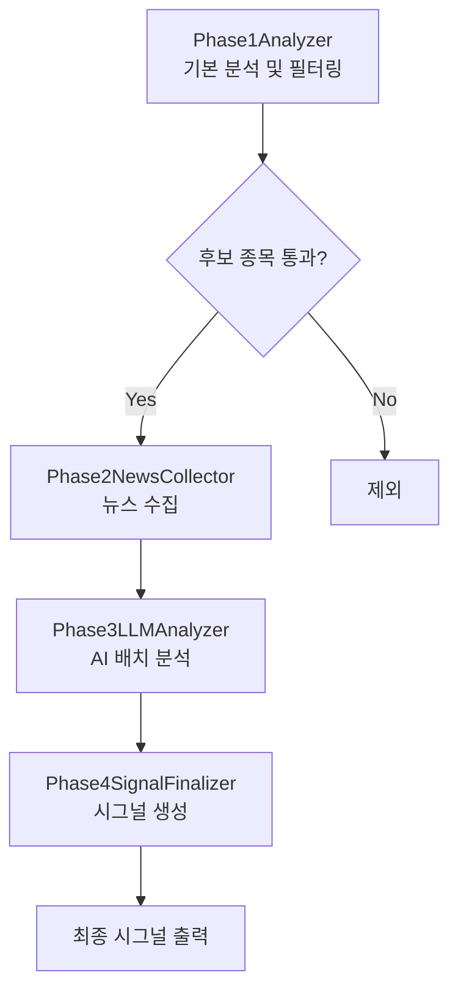
```mermaid
graph TD
    A[Phase1Analyzer<br>기본 분석 및 필터링] --> B{후보 종목 통과?}
    B -->|Yes| C[Phase2NewsCollector<br>뉴스 수집]
    B -->|No| X[제외]
    C --> D[Phase3LLMAnalyzer<br>AI 배치 분석]
    D --> E[Phase4SignalFinalizer<br>시그널 생성]
    E --> F[최종 시그널 출력]
```

**Phase 1: 기본 분석 및 사전 필터링**
- 상승률 상위 종목에 대해 기본 분석 수행
- 차트, 수급 데이터 수집
- Pre-Score 계산 (뉴스/LLM 제외)
- 필터 조건 검증 (Phase1 하드컷: 거래대금 500억+)

**Phase 2: 뉴스 수집**
- 네이버 금융, 다음 뉴스에서 최신 뉴스 수집
- 언론사별 가중치 부여 (한국경제 0.9, 일반 0.7)
- 중복 제거 및 품질 필터링

**Phase 3: AI 배치 분석**
- Gemini, GPT/Perplexity 병렬 분석
- `asyncio`와 `Semaphore`로 동시성 제어
- 교차 검증 및 신뢰도 산출

**Phase 4: 시그널 생성**
- 등급 산정 (S/A/B)
- 목표가/손절가 계산
- 최종 시그널 출력 및 저장

#### Flask API 구조 (Blueprint-based)

시스템은 Flask Blueprint를 사용하여 모듈형 라우팅과 관심사 분리를 구현합니다.

**한국 시장 API (`kr_market` Blueprint - `/api/kr`):**
- `GET /api/kr/market-status`: 한국 시장 현황 (KOSPI/KOSDAQ 지수, 환율, 수급)
- `GET /api/kr/signals`: 최신 VCP 및 외인매집 시그널 분석 결과 조회
- `GET /api/kr/jongga-v2/latest`: 최신 AI 종가베팅(V2) 분석 결과 조회
- `GET /api/kr/closing-bet/cumulative`: 종가베팅 전략의 누적 성과 및 승률 통계
- `POST /api/kr/realtime-prices`: 전 종목 실시간 가격 통합 조회 (Toss/YF 폴백)
- `GET /api/kr/market-gate`: Market Gate 상태 및 상세 스코어링 데이터
- `POST /api/kr/market-gate/update`: 시장 데이터 및 Market Gate 강제 동기화
- `POST /api/kr/signals/run`: VCP 시그널 생성 엔진 백그라운드 실행
- `POST /api/kr/jongga-v2/run`: AI 종가베팅 V2 엔진 백그라운드 실행
- `POST /api/kr/chatbot`: AI 투자 어드바이저(스마트머니봇)와 대화

**공통 API (`common` Blueprint - `/api`):**
- `GET /api/admin/check`: 관리자 권한 확인 (설치 및 설정용)
- `GET /api/portfolio`: 모의투자 포트폴리오 및 자산 현황 조회
- `POST /api/portfolio/buy`: 모의투자 매수 주문 체결
- `POST /api/portfolio/sell`: 모의투자 매도 주문 체결
- `GET /api/system/env`: 시스템 전체 환경 변수 관리 (관리자 전용)
- `GET /health`: 시스템 상태 및 API 가동 여부 체크 (Root)

```python
app/
├── routes/
│   ├── kr_market.py     # 한국 시장 관련 API (Blueprint: 'kr')
│   │   ├── get_kr_market_status  # /market-status (지수/환율/수급)
│   │   ├── get_kr_signals        # /signals (VCP 시그널)
│   │   ├── get_kr_market_gate    # /market-gate (시장 신호등)
│   │   ├── get_kr_realtime_prices # /realtime-prices (실시간 시세)
│   │   ├── get_jongga_v2_latest  # /jongga-v2/latest (V2 결과)
│   │   ├── get_cumulative_performance # /closing-bet/cumulative (성과)
│   │   ├── run_vcp_signals_screener # /signals/run (엔진 실행)
│   │   ├── run_jongga_v2_screener # /jongga-v2/run (엔진 실행)
│   │   └── chatbot               # /chatbot (AI 대화 엔진)
│   └── common.py        # 공통 및 유틸리티 API (Blueprint: 'common')
│       ├── check_admin           # /admin/check
│       ├── get_portfolio_data    # /portfolio
│       ├── buy_stock / sell_stock # /portfolio/buy, /portfolio/sell
│       ├── manage_env            # /system/env
│       └── send_test_notification # /notification/send
└── __init__.py          # 애플리케이션 팩토리 및 /health (Root)
```

#### 서비스 레이어 (Services Layer)

백그라운드에서 독립적인 생애주기를 가지며 비즈니스 로직을 수행하는 핵심 서비스들입니다.

```python
services/
├── scheduler.py      # 자동화된 스케줄링 서비스
│   ├── run_daily_closing_analysis # 장 마감 메인 체인 실행 (16:00)
│   ├── run_jongga_v2_analysis     # AI 종가베팅 심층 분석 엔진
│   ├── run_market_gate_sync       # 주기적 지표 동기화 (30분 단위)
│   └── start_scheduler            # 백그라운드 스레드 및 중복 실행 방지
├── notifier.py       # 멀티채널 알림 서비스
│   ├── NotificationService       # 핵심 알림 관리 클래스
│   ├── format_jongga_message     # 등급별 메시지 포맷팅 로직
│   └── send_all (Telegram/Discord/Slack/Email) # 전 채널 동시 발송
├── paper_trading.py  # 모의투자 서비스
│   ├── PaperTradingService       # 자산/포트폴리오 관리 클래스
│   ├── buy_stock / sell_stock    # 주문 체결 로직 및 DB 연동
│   ├── get_portfolio_valuation   # Toss API 연동 실시간 자산 평가
│   └── record_asset_history      # 누적 수익률 시계열 데이터 기록
├── activity_logger.py # 시스템 주요 이벤트 및 활동 로깅
└── usage_tracker.py   # API 호출 제한 및 토큰 사용량 모니터링
```

**스케줄러 서비스 (`scheduler.py`):**
- **Lock File 기반 중복 방지**: `fcntl`을 활용한 파일 락(`scheduler.lock`)으로 프로세스 중복 실행 원천 차단
- **16:00 KST - 장 마감 체인 분석 (Chain Execution)**: 모든 작업을 정해진 순서에 따라 원스톱으로 병렬/순차 실행
  1. **데이터 수집**: 일별 종가 및 투자자별 수급 데이터 확정본 동기화
  2. **VCP 분석**: 전 종목 기술적 패턴 필터링 및 VCP 시그널 생성
  3. **AI 종가베팅**: VCP 시그널 기반 AI(Gemini) 심층 정성적 분석 수행
  4. **알림 전송**: 모든 분석 완료 즉시 4개 채널(텔레그램 등)로 결과 발송
- **주기적 동기화**: 설정된 인터벌(기본 30분)에 따라 Market Gate 및 환율 실시간 최신화

**알림 서비스 (`notifier.py`):**
- **NotificationService 클래스**: 4채널 지원 알림 시스템
- **채널별 전송**:
  - Telegram Bot API (HTML parse mode)
  - Discord Webhook (Rich Embeds)
  - Slack Incoming Webhooks (Markdown)
  - Email SMTP (Gmail, Office 365)
- **D등급 자동 필터링**: 저품질 신호 제외
- **정렬 로직**: 등급순(S→A→B) → 점수순 정렬

**모의투자 서비스 (`paper_trading.py`):**
- **포트폴리오 관리**: 보유 종목, 매수 평단가, 수익률
- **매매 이력**: 모든 매수/매도 내역 자동 기록
- **실시간 가격**: Toss Securities API 연동
- **성과 분석**: 총 수익률, CAGR, MDD, 승률 계산

#### Frontend (Next.js)

Next.js 16의 App Router를 기반으로 한 반응형 웹 인터페이스입니다.

```python
frontend/src/app/
├── dashboard/           # 메인 대시보드 (종가베팅/VCP/마켓게이트)
├── chatbot/             # 스마트머니봇 AI 채팅 인터페이스
├── components/          # 공통 UI 컴포넌트 라이브러리 (Atomic Design)
│   ├── charts/          # 기술적 분석용 인터랙티브 차트
│   ├── signals/         # 시그널 리스트 및 상세 뷰
│   └── layout/          # 헤더, 사이드바, 푸터
├── api/                 # 프론트엔드 전용 API 프록시 및 핸들러
├── layout.tsx           # 전역 레이아웃 및 테마(Tailwind) 설정
└── page.tsx             # 메인 랜딩 페이지 및 상태 관리
```

- **Framework**: Next.js 16 (App Router, TypeScript)
- **UI Components**: React with Tailwind CSS
- **Real-time Updates**: WebSocket (or Interval Sync) for live updates
- **Testing**: Vitest (Unit & UI Tests)

#### Data & Storage (데이터 인프라)

본 프로젝트는 외부 API 의존성을 최소화하고 데이터 신뢰성을 보장하기 위해 검증된 오픈소스 라이브러리를 활용합니다.

**한국 시장 데이터 우선순위 및 폴백:**
1. **Toss Securities API** (최우선): 초고속 실시간 시세 (<1초 지연)
2. **Naver Securities API**: 안정적인 국내 주식 가격 정보 (폴백 1)
3. **yfinance**: 글로벌 지수/원자재/크립토 및 최종 가격 보완 (폴백 2)
4. **pykrx**: KRX 정보데이터시스템 기반 역사적 데이터 (폴백 3)

**Coverage:**
- KOSPI/KOSDAQ 지수 및 구성 종목
- 섹터 ETF (반도체, 2차전지 등) 시세
- 투자자별(외국인/기관) 수급 데이터
- 글로벌 지수 (S&P 500, NASDAQ)
- 환율 (USD/KRW) 및 원자재 선물
- 암호화폐 (BTC, ETH, XRP)

**Storage:**
- **CSV/JSON files**: flat structure (일일 종가, 시그널 로그)
- **SQLite (paper_trading.db)**: 모의투자 포트폴리오 및 매매 이력
- **Logging**:
  - Python: `logs/backend.log` (rotation)
  - Frontend: `logs/frontend.log` (필터링된 로그)

#### Notification Services
- **Telegram**: Bot API (sendMessage, HTML parse mode)
- **Discord**: Webhook with Rich Embeds
- **Slack**: Incoming Webhooks
- **Email**: SMTP (Gmail, Office 365 supported)

---

## 🤖 AI Core: 기술적 상세 (AI Detail)

이 시스템의 핵심 경쟁력은 **Rule-based Screening**과 **AI Reasoning**의 결합입니다. 단순한 지표 추천이 아닌, AI가 시장의 문맥(Context)을 이해하고 논리적인 "투자 가설(Investment Hypothesis)"을 생성합니다.

이 시스템의 백엔드는 단순한 API 호출이 아닌, **고성능 동시성 제어(Concurrency Control)** 와 **프롬프트 엔지니어링**의 집약체입니다.

### 1. Multi-Model AI Engine Architecture

서로 다른 특성을 가진 모델을 역할별로 분리해 운용합니다.  
VCP 분석은 **Gemini + (GPT 또는 Perplexity 중 1개)** 조합으로 실행되고, 결과는 모델별 필드로 분리 저장됩니다.

| 모델           | 역할                           | 사용 시나리오                                                 | 장점                                                              |
| -------------- | ------------------------------ | ------------------------------------------------------------- | ----------------------------------------------------------------- |
| **Gemini**     | **Analysis Agent** (심층 추론) | 복잡한 뉴스 분석, 긴 컨텍스트 윈도우 필요, 다차원 데이터 통합 | **심층 추론(Thinking)** 지원, 한-영문 혼용 처리, 복잡한 논리 사고 |
| **Perplexity** | **Search Agent** (실시간 정보) | 최신 뉴스 검색, 팩트 체크, 실시간 시장 이슈 파악              | **실시간 웹 검색(Web Search)**, 최신 정보 반영, 출처(Source) 명시 |
| **Z.ai / GPT** | **Speed Agent** (빠른 검증)    | 챗봇 대화, 단순 뉴스 감성 분석, 크로스 밸리데이션             | 빠른 응답 시간, OpenAI 호환성, 비용 효율적                        |

#### 교차 검증(Cross-Validation) 로직

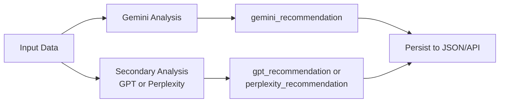
```mermaid
graph LR
    A[Input Data] --> B[Gemini Analysis]
    A --> C[Secondary Analysis\nGPT or Perplexity]
    B --> D[gemini_recommendation]
    C --> E[gpt_recommendation or\nperplexity_recommendation]
    D --> F[Persist to JSON/API]
    E --> F
```

**검증 규칙 (VCP 기준):**
1. Gemini는 기본 분석 모델로 실행됩니다.
2. 보조 모델은 `VCP_SECOND_PROVIDER` 값(`gpt` 또는 `perplexity`)에 따라 1개만 실행됩니다.
3. 결과는 자동 합의(평균/우선선택) 없이 모델별로 저장되며, 프론트엔드에서 탭으로 비교합니다.

### Concurrency Architecture
Python의 `asyncio`와 `ThreadPoolExecutor`를 결합하여, 동기식(Blocking)으로 동작하는 LLM 클라이언트 라이브러리들을 비동기 논블로킹(Non-blocking) 환경에서 병렬 실행합니다.

*   **구현 파일**: `engine/vcp_ai_analyzer.py`
*   **작동 방식**:
    1.  `VCPMultiAIAnalyzer`가 분석 요청을 수신합니다.
    2.  **Gemini/GPT**는 스레드 풀(`loop.run_in_executor`)로 실행하고, **Perplexity**는 `httpx.AsyncClient`로 비동기 호출합니다.
    3.  두 모델이 동시에 추론을 수행하고 응답을 개별 필드에 저장합니다.
    4.  합의 점수 산출 없이 `gemini_recommendation`, `gpt_recommendation`, `perplexity_recommendation` 형태로 반환합니다.

---

### 2. Prompt Engineering & Persona

단순한 챗봇이 아닌, **"스마트머니봇(Black Knight)"** 페르소나를 통해 일관된 투자 철학을 유지하며, **매일 변하는 시장 상황에 맞춰 AI가 먼저 질문을 제안하는 '동적 추천 질문(Dynamic Suggestions)'** 기능을 제공합니다.

*   **페르소나 정의 (`chatbot/prompts.py`)**:
    > "너는 수급과 리스크 관리를 최우선으로 하는 냉철한 펀드매니저다. 외국인/기관의 수급이 없는 상승은 '가짜'로 간주하며, 손절가(-5%)를 생명처럼 지킨다."

#### 2.1 System Persona 정의

**페르소나 이름**: 스마트머니봇 (Smart Money Bot) / 블랙나이트 (Black Knight)

**투자 철학 (Investment Philosophy):**

```python
# 메인 페르소나 (AI 상담 챗봇용)
SYSTEM_PERSONA = """너는 VCP 기반 한국 주식 투자 어드바이저 '스마트머니봇'이야.

## 전문 분야
- 외국인/기관 수급 분석 (60일 트렌드)
- VCP(Volatility Contraction Pattern) 진입 시점 판단
- Market Gate 섹터별 강도 분석
- 마크 미너비니 스타일 투자 전략

## 핵심 원칙
1. 수급이 곧 진실이다 - 외국인/기관 순매수가 핵심
2. 쌍끌이(외인+기관 동시 매수)가 가장 강력한 시그널
3. Market Gate가 GREEN일 때만 공격적 진입
4. 손절은 -5%, 목표는 +15~20%

## 🔥 RAG 데이터 활용 지침 (최우선 준수)
**아래 [데이터] 섹션에 제공되는 정보를 반드시 우선적으로 참고하여 답변해야 해:**
1. **[Market Gate 상세 분석]**: 시장 상태, 점수, 섹터 동향 → 시장 질문에 활용
2. **[VCP AI 분석 결과]**: Gemini/GPT/Perplexity AI 분석(설정 기반), 매수/매도 추천 → 종목 추천에 활용
3. **[종가베팅 추천 종목]**: S/A급 종목, 점수, AI 분석 → 종가베팅 질문에 활용
4. **[최근 뉴스]**: 수집된 최신 뉴스 제목 → 뉴스/이슈 질문에 활용

**데이터가 제공되면 반드시 해당 데이터를 인용하여 답변하고, 일반적인 지식보다 실시간 수집 데이터를 우선해.**
**데이터가 없거나 부족하면 솔직하게 "현재 수집된 데이터가 없습니다"라고 답변해.**

## 답변 스타일
1. **[추론 과정]** 섹션을 먼저 작성: 질문을 분석하고 데이터에 기반해 결론에 도달하는 과정을 **한글로 상세히** 서술해. (사용자에게 논리적 근거를 보여주기 위함)
2. **[답변]** 섹션 작성: 추론을 바탕으로 최종 답변을 깔끔하게 정리해.
   - 구체적 수치와 근거 제시
   - 리스크 언급 (손절가 등)
   - 마크다운 포맷 활용 (가독성 높임)

## ✨ 필수: 추천 질문 생성
답변 마지막에는 **반드시** 사용자가 이어서 할 만한 질문 3가지를 리스트 형태로 제안해줘.
예시:
[추천 질문]
1. 이 종목의 구체적인 진입가는 얼마인가요?
2. 현재 수급 상황은 어떤가요?
3. 관련된 최신 뉴스가 있나요?
"""
```

#### 2.2 상황별 맞춤 프롬프트 (Intent Injection)

**Intent-Based Prompting (의도 기반 프롬프트)**

사용자의 질문 의도(Intent)를 파악하여, 그에 맞는 최적화된 프롬프트를 동적으로 로딩합니다.

| 의도 (Intent)         | 프롬프트 전략   | 주요 내용                                                                  |
| --------------------- | --------------- | -------------------------------------------------------------------------- |
| **`recommendation`**  | **종목 추천**   | 수급 점수 상위 종목 중심, 사용자의 관심 섹터 반영, 진입 타이밍/손절가 제시 |
| **`analysis`**        | **종목 분석**   | 60일 수급 현황, 연속 매수일/비율 제공, VCP 패턴 충족 여부 진단             |
| **`market_overview`** | **시장 현황**   | Market Gate 기준 주도 테마, 전반적인 수급 동향 및 시장 분위기 요약         |
| **`closing_bet`**     | **종가베팅**    | S/A급 종목 우선 추천, 장 마감 전후 진입 전략 가이드                        |
| **`risk_check`**      | **리스크 관리** | 구체적인 손절가(-5%) 제시, 포지션 비중 조절 및 거시 위험 대응              |
| **`market_gate`**     | **시장 신호등** | 시장 상태(GREEN/YELLOW/RED)별 구체적 비중 및 공격성 조절 가이드            |
| **`vcp_analysis`**    | **VCP 시그널**  | Gemini/GPT/Perplexity AI 추천 결과 분석, VCP 점수 및 수축 비율 설명        |
| **`news_analysis`**   | **뉴스 분석**   | 최근 뉴스 데이터(제목/출처) 기반 인용, 종목 영향력 및 호재/악재 평가       |

**A. 뉴스 감성 분석 프롬프트 (News Sentiment Analysis)**

```python
# engine/llm_analyzer.py - analyze_news_sentiment()
NEWS_SENTIMENT_PROMPT = """
당신은 주식 투자 전문가입니다. 주어지는 뉴스들을 분석하여 호재 강도를 평가하세요.

[뉴스 목록]
{news_items}

[점수 기준 (Scoring Rubric)]
3점: 확실한 호재 (대규모 수주, 상한가 재료, 어닝 서프라이즈, 경영권 분쟁 등)
2점: 긍정적 호재 (실적 개선, 기대감, 테마 상승)
1점: 단순/중립적 소식 (일반 공시, 기본 실적 발표)
0점: 악재 또는 별다른 호재 없음 (악재, 리스크 우려)

[출력 형식]
뉴스 3개를 따로 평가하지 말고, **종목 전체에 대한 하나의 평가**를 내리세요.
반드시 아래 포맷의 **단일 JSON 객체**로만 답하세요. (Markdown code block 없이)

Format: {{"score": 2, "reason": "종합적인 요약 이유"}}
"""
```

**왜 이렇게 프롬프트를 구성했는가?**
- **단일 JSON 요구**: 프로그래밍적으로 파싱하기 쉬워 후속 처리 용이
- **0~3점 스케일**: 너무 많은 레벨이 아닌, 실행 가능한 액션(BUY/HOLD/SELL)으로 매핑
- **종합 평가 강조**: 개별 뉴스 평가가 아닌, 종목 전체의 재료 지속성 판단

---

**B. 배치 분석 프롬프트 (Batch Analysis - Closing Bet V2)**

```python
# engine/llm_analyzer.py - analyze_news_batch()
BATCH_ANALYSIS_PROMPT = """
당신은 주식 투자 전문가입니다. 시장 상황, 수급, 뉴스를 종합적으로 분석하여 투자 판단을 내리세요.

{market_context}

다음 종목들을 분석하여 투자 매력도를 평가하세요.
문서에 정의된 '종합 분석' 기준을 따릅니다.

[입력 데이터]
{stocks_text}

[평가 기준]
0. **VCP 분석 (필수)**:
   - 변동성 수축(Contraction Ratio)이 **0.7 이하**로 건전한가?
   - 거래량(Volume)이 급감하며 매물 소화가 잘 되었는가?
   - 이 기술적 지표가 점수에 **가장 큰 영향**을 미쳐야 함.
1. **Score (0-3)**: 뉴스/재료 기반 호재 강도
   - 3점: 확실한 호재 (대규모 수주, 상한가 재료, 어닝 서프라이즈)
   - 2점: 긍정적 호재 (실적 개선, 기대감, 테마 상승)
   - 1점: 단순/중립적 소식
   - 0점: 악재 또는 별다른 호재 없음
2. **Action**: BUY / HOLD / SELL
3. **Confidence**: 확신도 (0-100%)
4. **Reason**: 다음 요소를 종합하여 **3~5줄**로 구체적 근거를 포함하여 작성하세요.
   - 뉴스/재료 분석: 구체적 호재/악재 내용과 산업 영향도
   - VCP 기술적 분석: 수축 비율, 거래량 추이, 패턴 완성도 평가
   - 수급 동향: 외인/기관 매매 추이와 의미
   - 리스크 요인: 단기 과열, 밸류에이션, 업종 리스크 등
   - 매매 전략: 매수 시점, 목표가, 손절 기준 구체적 제시

[출력 형식]
반드시 아래 포맷의 **JSON 배열**로만 답하세요. (Markdown code block 없이)

[
    {{
        "name": "종목명",
        "score": 2,
        "action": "BUY",
        "confidence": 85,
        "reason": "대규모 신규 수주 발표로 강한 호재. 외인/기관 동반 순매수 유입 중."
    }}
]
"""
```

**왜 시장 컨텍스트를 주입했는가?**
- 시장 상황(강세/약세/중립)에 따라 동일한 뉴스라도 해석이 달라질 수 있음
- 예: 강세장에서의 호재 > 약세장에서의 호재

---

**C. VCP 기술적 분석 프롬프트 (VCP Technical Analysis)**

```python
# engine/vcp_ai_analyzer.py - _build_vcp_prompt()
VCP_ANALYSIS_PROMPT = """
당신은 주식 투자 전문가입니다. VCP(Volatility Contraction Pattern) 패턴 종목을 분석하세요.

[종목 정보]
- 종목명: {stock_name}
- 현재가: {current_price}
- VCP 점수: {vcp_score}
- 수축 비율: {contraction_ratio}
- 외국인 5일 순매수: {foreign_5d}주
- 기관 5일 순매수: {inst_5d}주

[분석 요청]
1. VCP 패턴과 수급 상황을 종합 분석
2. 매수/매도/관망 의견 제시
3. 신뢰도(0-100%) 평가

[출력 형식 - 반드시 JSON만 출력]
{"action": "BUY|SELL|HOLD", "confidence": 75, "reason": "기술적 분석 요약 (한국어, 2-3문장)"}
"""
```

**VCP 분석의 특징:**
- **변동성 수축(Contraction)**: 가격 폭이 줄어들면서 거래량이 줄어드는 구간 포착 (Range Contraction Ratio **0.7 이하** 필수)
- **매집(Accumulation)**: 외국인/기관의 지속적인 순매수 확인
- **AI 패턴 인식**: 단순 지표가 아닌, 패턴의 질적(Quality) 평가

---

**D. 시장 요약 프롬프트 (Market Summary)**

```python
# engine/llm_analyzer.py - generate_market_summary()
MARKET_SUMMARY_PROMPT = """
당신은 주식 시장 분석 전문가입니다. 오늘 '종가베팅' 알고리즘에 포착된 상위 종목 리스트입니다.
이들을 분석하여 다음 내용을 포함한 3~5줄 내외의 시장 요약 리포트를 작성해주세요.

1. 오늘의 주도 섹터/테마
2. 시장의 전반적인 분위기 (수급 강도 등)
3. 특히 주목할만한 특징

[종목 리스트]
{stocks_text}

[출력 형식]
줄글 형태로 간결하게 요약. (Markdown 사용 가능)
"""
```

---

### 3. 뉴스 감성 분석 (Advanced Sentiment Analysis)

`engine/kr_ai_analyzer.py`와 `engine/llm_analyzer.py`는 다중 소스(네이버 금융, 검색 등)에서 수집된 뉴스를 **가중치(Weight)** 기반으로 필터링한 후 AI에게 전달합니다.

#### 3.1 다중 소스 뉴스 수집

| 소스                 | 수집 방법                                         | 가중치(Weight) | 특징                           |
| -------------------- | ------------------------------------------------- | -------------- | ------------------------------ |
| **네이버 금융**      | `finance.naver.com/item/news.naver?code={ticker}` | 0.9 (Tier 1)   | 종목 전용 뉴스, 신뢰도 높음    |
| **네이버 뉴스 검색** | `search.naver.com/news`                           | 0.85 (Tier 2)  | 최신성 확보, 광범위한 커버리지 |
| **다음 뉴스**        | `search.daum.net/news`                            | 0.8 (Tier 2)   | 네이버와 상호 보완             |

#### 3.2 언론사별 가중치 (Media Credibility)

```python
# engine/kr_ai_analyzer.py
MAJOR_SOURCES = {
    "한국경제": 0.9,      # 주요 경제지 (Tier 1)
    "매일경제": 0.9,
    "머니투데이": 0.85,
    "서울경제": 0.85,
    "이데일리": 0.85,
    "연합뉴스": 0.85,
    "뉴스1": 0.8,
    # 기타 일반 인터넷 언론: 0.7 (Tier 2)
}
```

**왜 가중치를 적용했는가?**
- **신뢰도 차등화**: 주요 경제지 뉴스 > 인터넷 언론 루머
- **중복 제거**: 같은 뉴스가 여러 소스에서 나오면 가중치 합산 후 한 번만 전달
- **품질 필터링**: 낮은 가중치(0.5 이하)는 AI 입력 전 자동 제외

#### 3.3 AI의 역할: 문맥(Context) 파악

AI는 단순 뉴스 요약이 아니라, **재료의 지속성(Durability)** 을 판단합니다:

| 뉴스 유형       | AI 해석               | 예시                           |
| --------------- | --------------------- | ------------------------------ |
| 단순 공시       | Score 1점 (중립적)    | "정기 주주총회 개최 공시"      |
| 실적 서프라이즈 | Score 2~3점 (호재)    | "1Q 영업이익 YoY +40% 어닝"    |
| 대규모 수주     | Score 3점 (강한 호재) | "해외 3년치 플랜트 수주 1조원" |
| 악재 루머       | Score 0점 (악재)      | "경쟁사 해외 사업 매각"        |

---

### 4. Async Batch Processing & Rate Limit Handling

대규모 종목(2000개)를 실시간으로 분석하기 위해 **비동기 배치 처리**를 구현했습니다.

#### 4.1 동시성 제어 (Concurrency Control)

```python
# engine/llm_analyzer.py - analyze_news_batch()
import asyncio
from asyncio import Semaphore

# 최대 5개 동시 API 호출 제한
semaphore = Semaphore(5)

async def analyze_single_stock(item):
    async with semaphore:  # Rate Limit 방지
        # AI API 호출
        result = await llm.analyze(...)
        return result

# 병렬 실행
results = await asyncio.gather(*[analyze_single_stock(item) for item in items])
```

**설계 의도:**
- **Rate Limit 방지**: API 공급자의 초당 호출 제한(예: 10 req/s) 준수
- **시간 최적화**: 순차 처리(2000초) → 병렬 처리(40초)로 50배 속도 향상

#### 4.2 Retry Logic with Exponential Backoff

```python
# Gemini Rate Limit (HTTP 429) 처리
max_retries = 3
for attempt in range(max_retries):
    try:
        response = await api_call()
        break
    except Exception as e:
        if "429" in str(e) or "RESOURCE_EXHAUSTED" in str(e):
            if attempt < max_retries - 1:
                wait_time = (2 ** attempt) + 1  # 2초, 3초, 5초
                logger.warning(f"Rate limit hit. Retrying in {wait_time}s...")
                await asyncio.sleep(wait_time)
                continue
        raise e
```

---

### 5. 투자 가설 생성 (Investment Hypothesis)

AI는 단순한 매수/매도 의견이 아닌, **논리적인 투자 가설**을 생성합니다.

```python
# engine/kr_ai_analyzer.py - _analyze_with_gemini()
# 실제 AI가 생성하는 구조화된 리포트
INVESTMENT_HYPOTHESIS = """
[핵심 투자 포인트]
• 주력 제품의 수출 호조세 지속 및 글로벌 점유율 확대
• 신규 수주 공시로 인한 향후 3년치 일감 확보

[리스크 요인]
• 글로벌 경기 둔화 우려에 따른 전방 산업 수요 위축
• 환율 변동성에 따른 단기 환차손 가능성

[종합 의견]
동사는 {name} 분야의 선도 기업으로, 최근 {driver} 점이 긍정적입니다.
특히 3분기 실적 서프라이즈와 함께 연간 가이던스가 상향 조정된 점이
주가 상승의 주요 트리거가 될 것으로 판단됩니다.
현재 밸류에이션은 역사적 저점 수준으로, 중장기적 관점에서 매수 접근이 유효해 보입니다.
"""
```

**구조의 이점:**
1. **투자 포인트 명확화**: 사용자가 왜 매수해야 하는지 이해 용이
2. **리스크 노출**: 단순 호재 강조가 아닌, 리스크도 명시
3. **논리적 연결**: 드라이버 → 가설 → 결론의 흐름 구성

---

## 📊 주요 기능 및 알고리즘

### 1. Market Gate (시장 신호등 - 최상위 관문)

시장의 거시적/미시적 환경을 정량화하여 **"지금 주식을 사도 되는가?"** 를 결정하는 최상위 관문입니다. 하락장에서는 아무리 좋은 종목도 5~10% 급락 가능성이 있어, 시장 상태를 먼저 확인하는 것이 계좌를 지키는 핵심입니다.

시장의 거시적/미시적 데이터를 정량화하여 **"매수 버튼을 활성화할지"** 결정하는 최상위 관문입니다. 코드 레벨(`engine/market_gate.py`)에서 구현된 실제 스코어링 로직은 다음과 같습니다.

*   **총점 100점 만점** (40점 이상 Open)

| 카테고리      | 지표       | 상세 조건                       | 배점     | 비고                              |
| ------------- | ---------- | ------------------------------- | -------- | ------------------ |
| **Technical** | **Trend**  | KODEX 200 20일 > 60일 (정배열)  | **25점** | 추세 추종          |
| **(100점)**   | **RSI**    | RSI 14일 기준 50~70 구간 (강세) | **25점** | 과매수/과매도 회피 |
|               | **MACD**   | MACD > Signal (골든크로스)      | **20점** | 모멘텀 확인        |
|               | **Volume** | 거래량 > 20일 평균거래량        | **15점** | 거래 활성화        |
|               | **RS**     | KOSPI 대비 상대 수익률          | **15점** | 시장 주도력 확인   |

*   **Gate Closed 트리거**: 총점이 **40점 미만(Bearish)** 인 경우 '기술적 약세장'으로 판단하여 매매를 보류합니다. (환율 1480원 이상은 Warning으로 표시)

#### 1.1 구성 지표

| 카테고리      | 지표            | 임계값                   | 점수 배점 |
| ------------- | --------------- | ------------------------ | --------- |
| **Technical** | KODEX 200 지수  | 정배열 여부              | 25점      |
|               | RSI (KODEX 200) | 50~70 최적구간           | 25점      |
|               | MACD Signal     | 골든크로스               | 20점      |
|               | 거래량 (Liquid) | 20일 평균 상회           | 15점      |
|               | 상대강도 (RS)   | KOSPI 대비 2%p 이상 우위 | 15점      |
|               |                 | KOSPI 대비 0~2%p 우위    | 10점      |
|               |                 | KOSPI 대비 -2~0%p 열위   | 5점       |

**총점 100점 만점** (40점 미만 시 Gate Closed)

#### 1.2 Gate 판정 로직

```python
# engine/market_gate.py
def evaluate_market_gate():
    score = 0

    # 1. KODEX 200 정배열
    if kodex_200_ma20 > kodex_200_ma60:
        score += 25

    # 2. RSI 확인
    if 50 <= rsi_14day <= 70:  # 최적 구간
        score += 25

    # 3. MACD 시그널
    if macd_line > signal_line:
        score += 20

    # 4. 거래량 분석
    if volume > avg_volume_20d:
        score += 15

    # 5. 상대강도 (RS) - Tiered Score
    if rs_score > 2.0:
        score += 15
    elif rs_score >= 0:
        score += 10
    elif rs_score >= -2.0:
        score += 5

    # 판정
    if score >= 40:
        return MarketStatus.GATE_OPEN, f"{score}점: 매수 허용"
    else:
        return MarketStatus.GATE_CLOSED, f"{score}점: 매수 보류"
```

#### 1.3 Rule-Based Scorer (기본 12점 + 가산 7점)
`engine/scorer.py`는 AI 분석 전, 순수 데이터 기반으로 종목의 기술적/수급적 완성도를 평가합니다.

- **기본 점수 (Max 12점)**:
  - **뉴스/재료 (3점)**: LLM 감성 분석 및 거래대금 연동
  - **거래대금 (3점)**: 절대 규모 및 상대적 폭발성
  - **캔들/추세 (1점)**: 캔들의 형태 및 정배열 여부
  - **타이밍/수축 (1점)**: 볼린저밴드 수축 및 횡보 구간
  - **차트/패턴 (2점)**: VCP 완성도 및 주요 이평선 돌파
  - **수급 (2점)**: 외국인/기관 동반 순매수 및 기여도
- **가산점 (Max 7점)**: 거래량·차트 신호 기반
- **등급 판정 (`GradeClassifier`)**:
  - **S급**: 거래대금 1조+ / 10점+ / 등락률 하한(`MIN_CHANGE_PCT`, 기본 0%) 이상 (풀배팅)
  - **A급**: 거래대금 5000억+ / 8점+ / 등락률 하한(`MIN_CHANGE_PCT`, 기본 0%) 이상 (기본배팅)
  - **B급**: 거래대금 1000억+ / 6점+ / 등락률 하한(`MIN_CHANGE_PCT`, 기본 0%) 이상 (절반배팅)

#### 1.3 왜 Market Gate가 필요한가?

**시나리오 A (Market Gate 없음):**
- 하락장에서 좋은 종목 포착 → 매수 → 익일 -8% 급락
- **결과**: 수익률 -40% (10번 중 6번 손실)

**시나리오 B (Market Gate 적용):**
- 하락장 감지 → 모든 신호 차단 → 현금 보유
- **결과**: 리스크 완전 회피, 하락장 종료 후 재진입

---

### 2. KR Market Analysis (한국 시장 분석)

한국 주식 시장 전체를 분석하여 섹터별 흐름과 시장 점유율을 파악합니다.

#### 2.1 데이터 수집 지표

| 지표                                        | 출처                   | 활용 목적                   |
| ------------------------------------------- | ---------------------- | --------------------------- |
| **KOSPI/KOSDAQ 지수**                       | KRX, FinanceDatareader | 시장 전체 추세 파악         |
| **환율 (USD/KRW, EUR/KRW, JPY/KRW)**        | FX API                 | 수출주/수입주 영향 분석     |
| **업종 지수** (반도체, 전기전자, 바이오 등) | KRX                    | 섹터 순환매 파악            |
| **외국인/기관 일별 매매 동향**              | KRX, Naver Finance     | 시장 참여자 성향 분석       |
| **전일 거래대금 상위 종목**                 | KRX                    | 시장 리더십(Liquidity) 파악 |

#### 2.2 분석 기능

**A. 섹터 모멘텀(Sector Momentum) 분석**
- 최근 5일 동안 상승률이 높은 섹터 식별
- 섹터 내 상위 종목들의 공통 테마 추출
- 예: "AI 반도체 테마 강세", "2차전지 호조"

**B. 시장 점유율(Market Dominance) 분석**
- KOSPI 상위 50종목의 시가총액 합산 비중
- 시장 대표종목의 방향성 확인 (대형주 주도 vs 소형주 주도)

**C. 외국인/기관 수급 패턴**
- 5일/20일/60일 누적 순매수 추이 확인
- 순매수 금액 규모로 매수 강도 정량화
- 예: 외인 3일 연속 순매수 +1000억 → "외인 매집 중"

#### 2.3 AI 통합 방식

```python
# engine/kr_ai_analyzer.py - analyze_stock()
AI 통합 순서:
1. 종목 정보 조회 (가격, PER, PBR, ROE)
2. 뉴스 수집 (네이버 + 다음 + 검색, 가중치 부여)
3. Gemini 분석:
   - 뉴스 호재/악재 판단
   - 투자 포인트와 리스크 요인 식별
   - 종합 의견(매수/매도/관망) 생성
4. GPT/Perplexity 분석 (크로스 밸리데이션):
   - Gemini와 동일한 결론인지 확인
   - 기술적 지표 기반 보완 의견 제시
5. 결과 통합:
   - 두 AI의 액션 일치 시 → 신뢰도 평균
   - 불일치 시 → 더 높은 신뢰도 채택
```

**출력 예시:**
```json
{
    "ticker": "005930",
    "name": "삼성전자",
    "price": 75000,
    "gemini_recommendation": {
        "action": "BUY",
        "confidence": 88,
        "reason": "AI 반도체 호조세에 따른 수혜 예상. 외국인 5일 연속 순매수."
    },
    "gpt_recommendation": {
        "action": "BUY",
        "confidence": 82,
        "target_price": 85000,
        "stop_loss": 72000
    },
    "final_recommendation": {
        "action": "BUY",
        "confidence": 85,
        "reason": "Gemini: AI 반도체 호조세 / GPT/Perplexity: 기술적 매매"
    }
}
```

---

**3. VCP Signals (변동성 축소 패턴)**

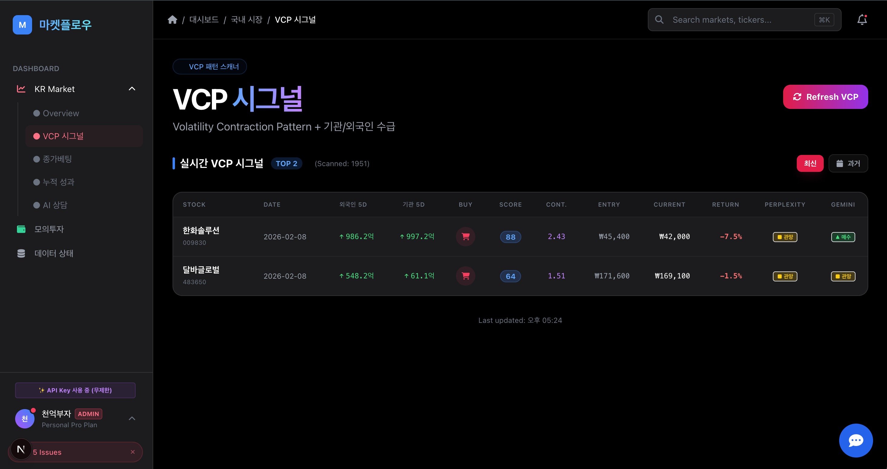
*VCP 패턴이 포착된 종목 리스트 및 요약 정보*

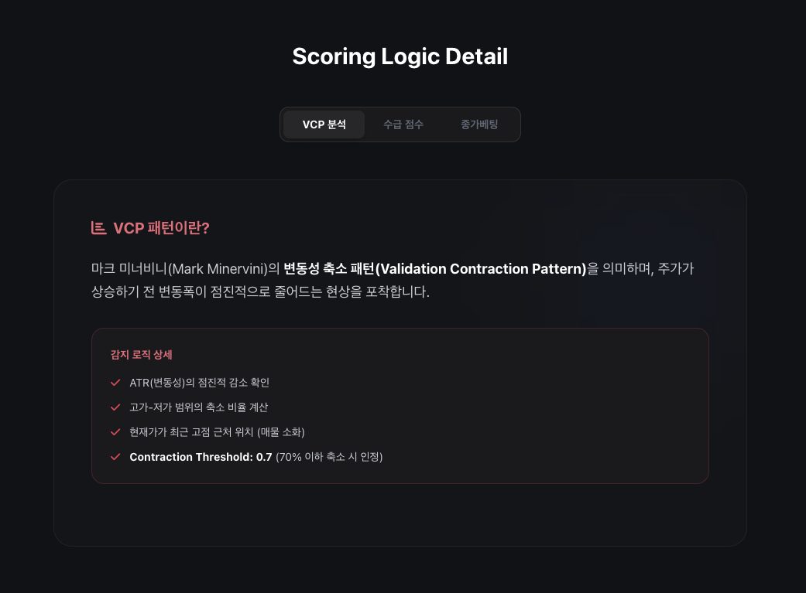
*VCP 패턴 상세 리포트*

마크 미너비니(Mark Minervini)의 **VCP (Volatility Contraction Pattern)** 전략을 한국 시장에 맞게 튜닝했습니다. VCP는 "가격이 상승하면서 변동성이 줄어드는 구간"으로, 이는 대형주나 기관 매집 구간에서 자주 관찰됩니다.


*개별 종목의 VCP 패턴 분석 및 AI 투자 의견 상세*

마크 미너비니의 VCP 이론을 파이썬 알고리즘으로 구현했습니다.

*   **수집 알고리즘 (`engine/screener.py`)**:
    *   **거래대금(Liquidity)**: 최소 1,000억 원 이상.
    *   **거래량 급증(Volume Breakout)**: 전일 대비 거래량 급증은 보조 지표로 활용.
    *   **Pivot Point**: 최근 저점을 높이며 5일 이평선 위에 안착.

#### 3.1 VCP 정의와 이론

**VCP (Volatility Contraction Pattern) 4단계:**

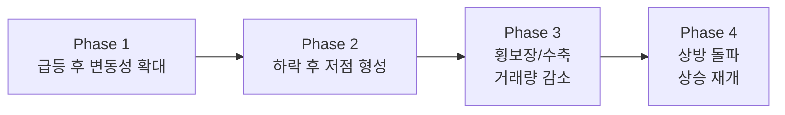
```mermaid
graph LR
    A[Phase 1<br>급등 후 변동성 확대] --> B[Phase 2<br>하락 후 저점 형성]
    B --> C[Phase 3<br>횡보장/수축<br>거래량 감소]
    C --> D[Phase 4<br>상방 돌파<br>상승 재개]
```

| 단계        | 특징                     | 목적               |
| ----------- | ------------------------ | ------------------ |
| **Phase 1** | 급등 + 높은 변동성       | 관심도 집중        |
| **Phase 2** | 하락 → 저점 형성         | 저점 매집 기회     |
| **Phase 3** | **횡보장 + 변동성 수축** | **핵심 포착 구간** |
| **Phase 4** | 상방 돌파 + 상승 재개    | 매수 진입 시점     |

#### 3.2 기술적 스크리닝 및 점수 산정 (Scoring System)

종가베팅 시스템은 **기본 점수(12점)** 와 **가산점(최대 7점)** 을 결합한 **총 19점 만점** 체계를 따릅니다.

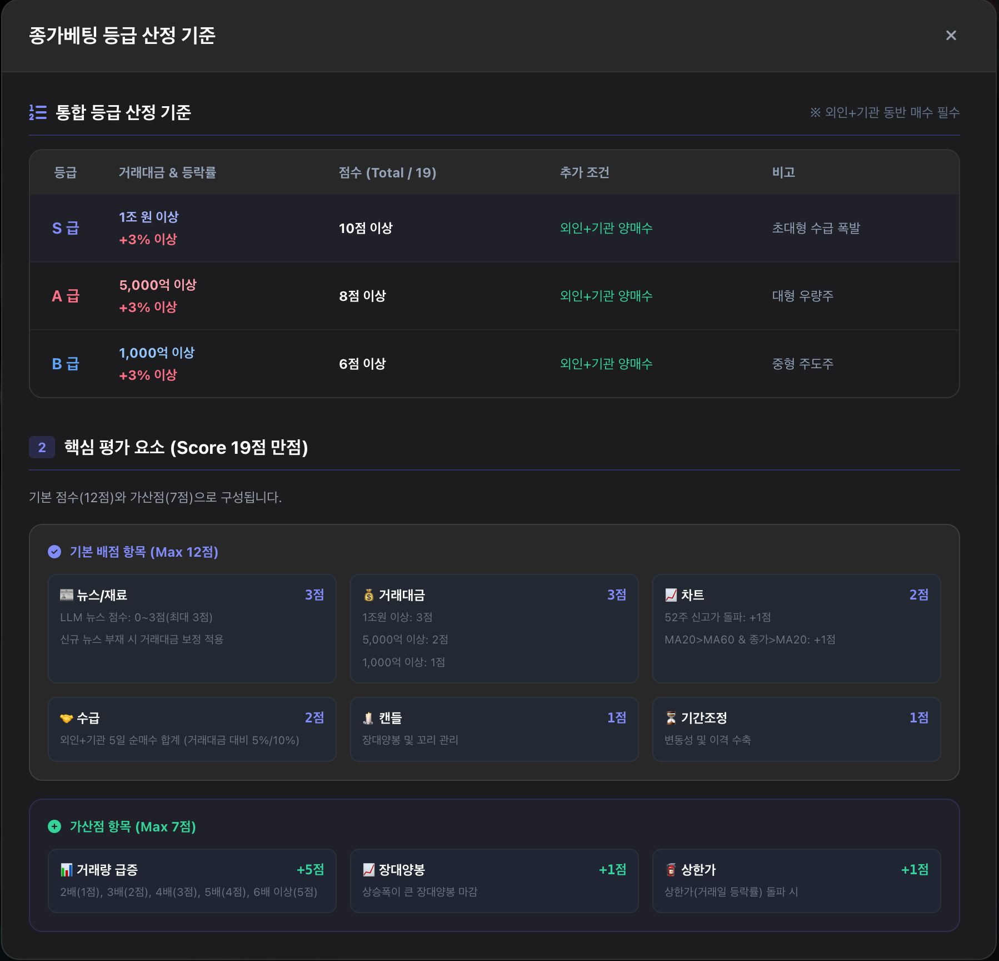
*시스템에 적용된 3단계(S/A/B) 등급 산정 세부 기준*

**A. 기본 배점 항목 (Max 12점)**
| 항목            | 배점  | 상세 기준                                      | 평가 목적          |
| :-------------- | :---: | :--------------------------------------------- | :----------------- |
| **📰 뉴스/재료** |  3점  | LLM 뉴스 점수: 0~3점 (최근 3일 내 재료 강도 기반)<br>0점: 명확한 호재 부족, 1~2점: 보완/단기성, 3점: 지속성 있는 대형 호재<br>재료 부재 시 거래대금 보정 적용 | 재료의 지속성 판단 |
| **💰 거래대금**  |  3점  | 1조 이상: 3점<br>5,000억 이상: 2점<br>1,000억 이상: 1점 | 시장 주도력 평가   |
| **📈 차트 패턴** |  2점  | 52주 신고가 돌파: +1점<br>MA20 > MA60 and 종가 > MA20: +1점 | 기술적 추세 확인   |
| **🤝 수급**      |  2점  | 외국인+기관 5일 순매수 합계(거래대금 대비 5%/10%) | 메이저 자금 유입   |
| **🕯️ 캔들 형태** |  1점  | 장대양봉 및 윗꼬리 관리 (몸통 > 꼬리×2)        | 매수 세력 강도     |
| **⏱️ 기간조정**  |  1점  | 볼린저밴드 수축 및 횡보 후 돌파                | 에너지 응축 확인   |

**B. 가산점 항목 (Max 7점)**
| 항목              | 배점  | 상세 조건                                                          |
| :---------------- | :---: | :----------------------------------------------------------------- |
| **📊 거래량 급증** | +5점  | 전일 대비 거래량 비율 (2배: 1점, 3배: 2점, 4배: 3점, 5배: 4점, 6배 이상: 5점) |
| **🕯️ 장대양봉**   | +1점  | 장대양봉 형태 및 유효성 (몸통/꼬리 기반)                            |
| **🧯 상한가**     | +1점  | 상한가(거래일 등락률) 돌파 여부                                      |

##### 📋 점수별 의미
```
┌─────────────────────────────────────────────────────────────┐
│  17~19점   │  최강 주도주 (기본 만점 + 가산점 대량 획득)     │
│  13~16점   │  강력 주도주 (기본 고득점 + 가산점 포함)        │
│  8~12점    │  우량 시그널 (전통적인 수급/차트 우량주)        │
│  6~7점     │  관망/조건부 (최소 요건 충족)                   │
│  5점 이하  │  등급 미달 (시그널 제외)                        │
└─────────────────────────────────────────────────────────────┘
```

**C. 통합 등급 산정 기준 (Grade Logic)**
|  등급   | 거래대금 기준              | 점수 (Total / 19) | 추가 조건 (외인+기관 양매수)           | 비고             |
| :-----: | :------------------------- | :---------------: | :------------------------------------ | :--------------- |
| **S급** | **1조원 이상**             |   **10점 이상**   | 외인+기관 **양매수**                   | 초대형 수급 폭발 |
| **A급** | **5,000억 이상**           |   **8점 이상**    | 외인+기관 **양매수**                   | 대형 우량주      |
| **B급** | **1,000억 이상**           |   **6점 이상**    | 외인+기관 **양매수**                   | 중형 주도주      |

> [!NOTE]
> **등급 판정 우선순위**: S급 → A급 → B급 순으로 판정하며, 상위 등급 조건을 만족하면 해당 등급이 부여됩니다.
> **주의**: 점수만으로는 등급이 결정되지 않습니다. 거래대금, 등락률 하한(`MIN_CHANGE_PCT`, 기본 0%) 이상, 외인+기관 양매수 조건을 **모두 만족**해야 해당 등급이 부여됩니다.

#### 3.3 기술적 스크리닝 조건 (Screening Rules)
```python
# engine/scorer.py
vcp_conditions = {
    # 60일 고가 대비 -10% 이내 (하락 폭 제한)
    "max_drawdown": -0.10,

    # 최근 20일 동안 변동성이 줄어듬
    "volatility_contraction": True,

    # 거래량이 줄어들면서 가격 유지 (수축 구간)
    "volume_decline": True,

    # 최근 저점에서의 반등 (바닥 형성)
    "pivot_low": True
}
```

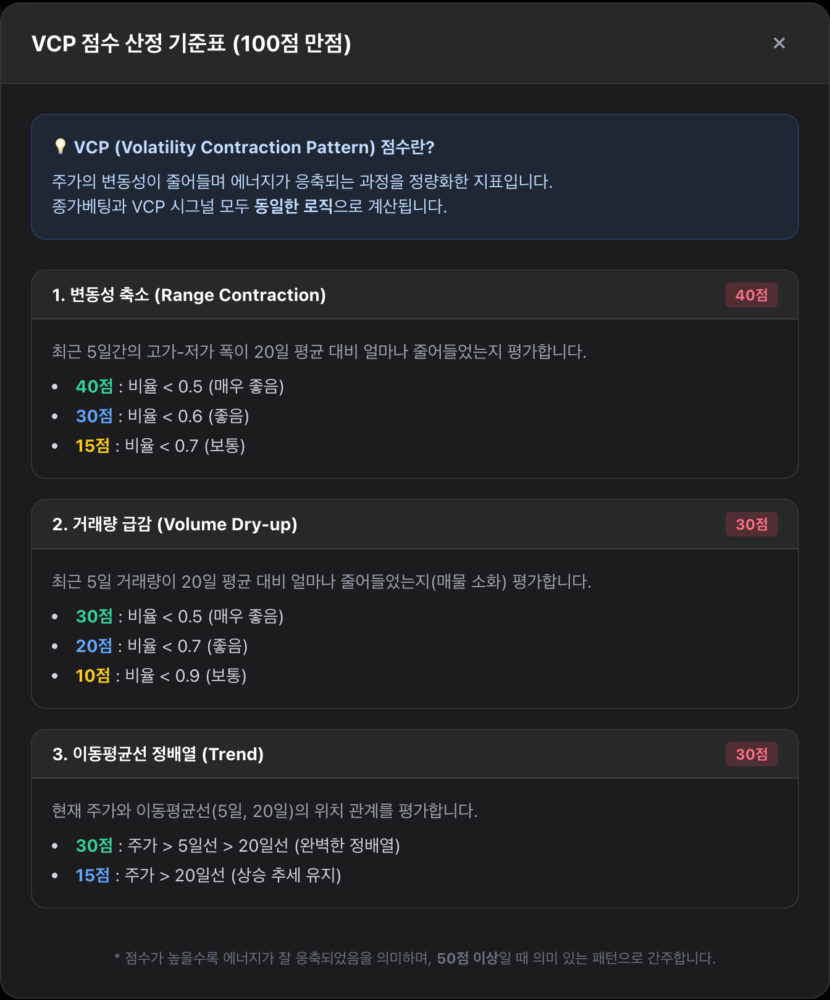
*VCP 기준표*

**B. VCP 점수 산정 (0~100점)**
| 구성 요소            | 점수 | 계산 방식                             |
| -------------------- | ---- | ------------------------------------- |
| **변동성 수축 비율** | 30점 | (최근10일 변동성) / (이전20일 변동성) |
| **가격 위치**        | 20점 | 60일 고가 대비 현재가 위치 (0~100%)   |
| **거래량 패턴**      | 20점 | 수축 구간 내 거래량 감소율            |
| **이평선 정배열**    | 15점 | 5일 > 20일 > 60일                     |
| **RSI 상태**         | 15점 | 40~60 사이 (과매수/과매도 아님)       |

**등급 부여 기준:**
- **VCP 점수 85점 이상**: A급 (Strong VCP)
- **VCP 점수 70~84점**: B급 (Moderate VCP)
- **VCP 점수 60~69점**: 약화 패턴 (권장 신호 아님)
- **VCP 점수 60점 미만**: 자동 제외 (D등급 필터링)

#### 3.3 VCP Signals 주요 기능 (New)

최신 업데이트된 VCP Signals 시스템은 단순한 패턴 매칭을 넘어 실시간 데이터와 AI 분석을 통합하여 제공합니다.

**A. 실시간 가격 추적 (Real-time Tracking)**
- **평일 장중 (09:00~15:30)**: `yfinance` API를 통해 **1분 단위** 실시간 시세(Entry, Current, Return)를 추적합니다.
- **장외/주말**: 마지막 종가(`daily_prices.csv`)를 기준으로 폴백(Fallback) 처리하여 언제든 데이터 조회 가능.
- **Entry Price 대비 수익률**: 진입가 대비 현재 수익률을 실시간으로 계산하여 표시합니다.

** B. AI 심층 분석 및 뉴스 연동 (AI & News)**
- **Multi-Model Analysis**: VCP는 Gemini(주분석) + 보조모델 1개(GPT 또는 Perplexity) 조합으로 실행되며, 모델별 결과를 비교합니다.
- **뉴스 자동 수집**: `EnhancedNewsCollector`가 각 시그널 발생 종목의 최신 뉴스를 자동으로 수집하여 AI에게 제공합니다.
- **AI 추천 배지**: AI의 분석 결과(매수/관망/매도)를 직관적인 배지로 시각화하여 제공합니다.

**C. 필터링 및 품질 관리 (Quality Control)**
- **Score 60+ 필터**: VCP 점수 60점 미만의 낮은 품질 시그널은 수집 및 표시 단계에서 **자동으로 제외**됩니다.
- **VCP 범위 시각화**: 차트상에 전반부(최근 30일 고점)와 후반부(최근 10일 저점) 범위를 시각적으로 표시하여 패턴의 유효성을 직관적으로 판단할 수 있습니다.
    
**D. 종가베팅 등급 기준 (Closing Bet Grade Criteria)**

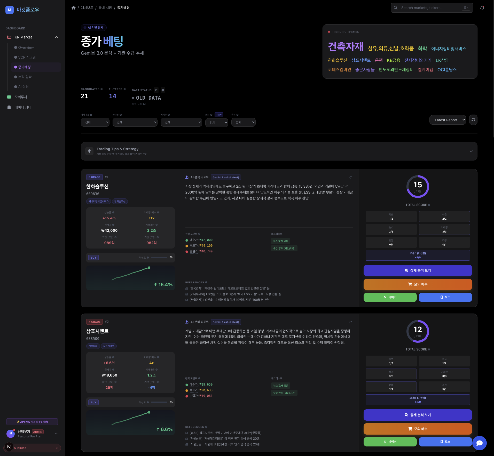
*장 마감 직전 포착된 종가 베팅 후보 종목 리스트*

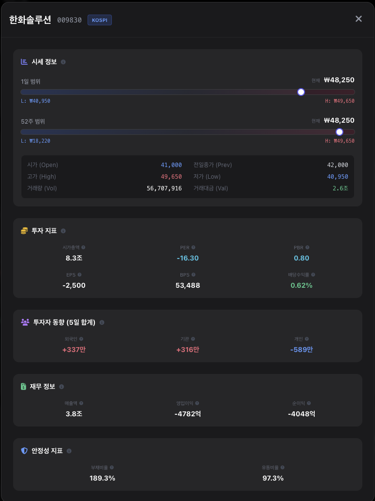
*종목 상세 리포트*

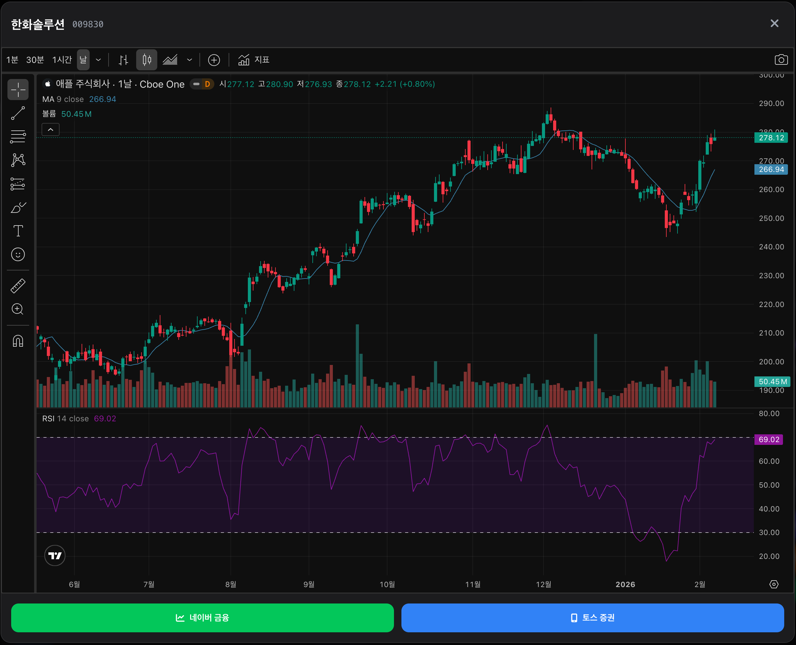
*종목 차트 상세 리포트*


---

**4. Paper Trading (모의투자)**

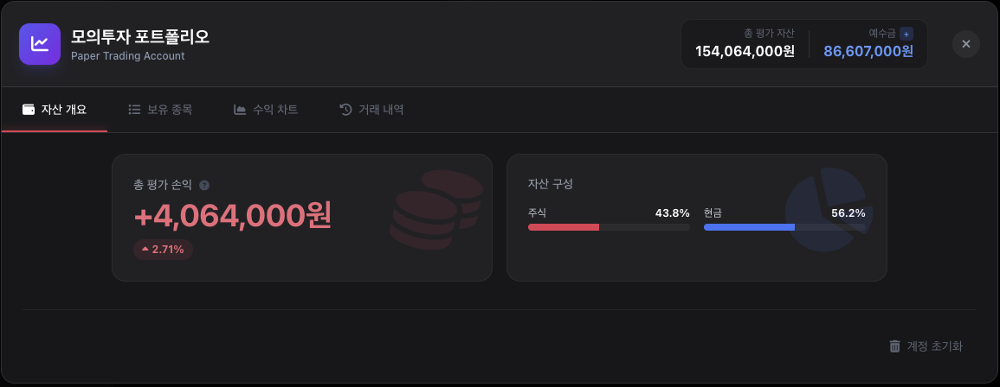
*보유 자산 현황 및 실시간 수익률 대시보드*

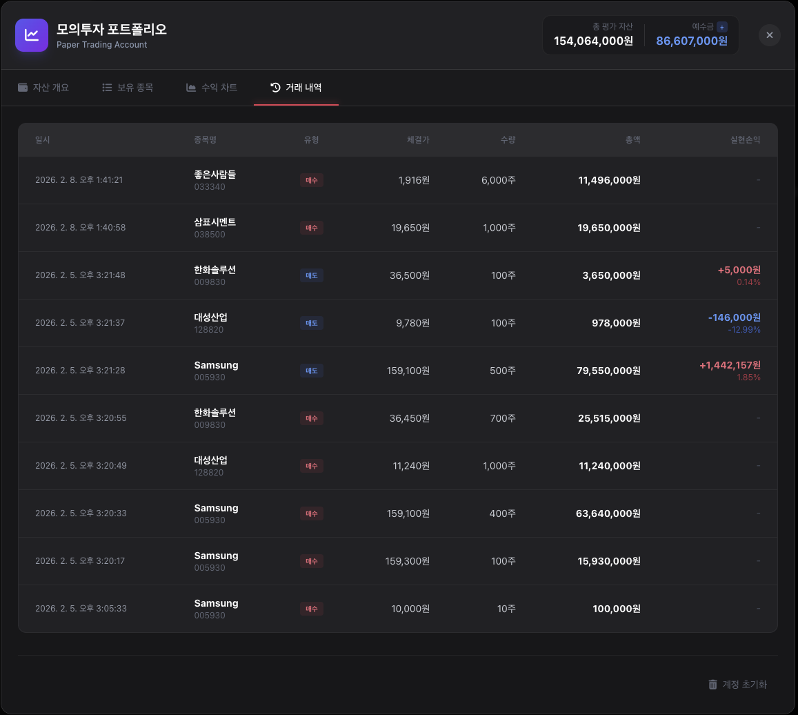
*거래 내역*

실시간 시장 데이터를 기반으로 가상의 자산을 운용하며 투자 전략을 검증할 수 있는 기능을 제공합니다.

#### 4.1 핵심 기능
- **실시간 포트폴리오 관리**: 현재 보유 종목, 매수 평단가, 수익률 실시간 확인
- **Toss Securities API 연동**: 토스증권 API를 통한 초고속 실시간 가격 데이터 업데이트 (**1초 이내 지연시간**)
- **차트 및 시계열 분석**: 누적 수익률 추이 및 자산 변동 그래프 제공
- **매매 이력 관리**: 과거 모든 매매 내역(매수/매도) 자동 기록 및 수익금 산출

#### 4.2 주요 화면

|          종목 보유 현황           |         수익률 변동 차트          |
| :-------------------------------: | :-------------------------------: |
|  |  |
| *현재 보유 중인 종목 상세 리스트* |   *누적 수익률 변동 추이 차트*    |

|          매수 주문 (Buy)          |         매도 주문 (Sell)          |
| :-------------------------------: | :-------------------------------: |
|  |  |
|  *수량 및 가격 설정을 통한 매수*  | *실시간 가격 기반 수익 확정 매도* |

#### 3.4 AI VCP 분석 (Multi-AI Validation)

```python
# engine/vcp_ai_analyzer.py - analyze_stock()
async def analyze_stock(stock_name: str, stock_data: Dict):
    # 1. Gemini 분석 (심층 추론 + 뉴스 분석)
    gemini_result = await _analyze_with_gemini(stock_name, stock_data)

    # 2. GPT/Perplexity 분석 (크로스 밸리데이션)
    gpt_result = await _analyze_with_gpt(stock_name, stock_data)


    # 3. 결과 통합
    return {
        'stock_name': stock_name,
        'vcp_score': stock_data['vcp_score'],
        'gemini_recommendation': gemini_result,  # {"action": "BUY", "confidence": 85, ...}
        'gpt_recommendation': gpt_result,      # {"action": "BUY", "confidence": 80, ...}
        'consensus': 'AGREE' if gemini_result['action'] == gpt_result['action'] else 'DISAGREE'
    }
```

**AI 프롬프트 (VCP 전용):**
```
VCP 패턴과 수급 상황을 종합 분석하세요.

[종목 정보]
- VCP 점수: 85점 (강한 수축)
- 외국인 5일 순매수: +500만주
- 기관 5일 순매수: +300만주

[분석 요청]
1. VCP 패턴이 유효한가? (상방 돌파 가능성)
2. 매집(Accumulation)이 진행 중인가? (수급 확인)
3. 매수/매도/관망 의견 제시
4. 신뢰도(0-100%) 평가

[출력]
{"action": "BUY|SELL|HOLD", "confidence": 75, "reason": "VCP 완성, 외인/기관 동반 매집 중"}
```

#### 3.4 왜 VCP를 사용하는가?

**전략적 우위:**
1. **위험/보상 비율 최적화**: 수축 구간 매수 → 상방 돌파 시 급등
2. **기관 매집 파악**: 거래량 감소 + 수급 유입 = "비밀리 매집" 신호
3. **진입 시점 정교화**: 차트 패턴이 아닌, 패턴 완성 시점 포착

---


### 4. 알고리즘 및 기술적 상세

#### 4.1 종가베팅 (Closing Bet) 알고리즘
**전략 시나리오:**
- **장 마감 직후 (기본 16:00 체인)**: 후보군 스크리닝 → AI 필터링 → 최종 신호 생성
- **익일 09:00~09:30**: 목표가/손절가에 따라 자동 매도 추천

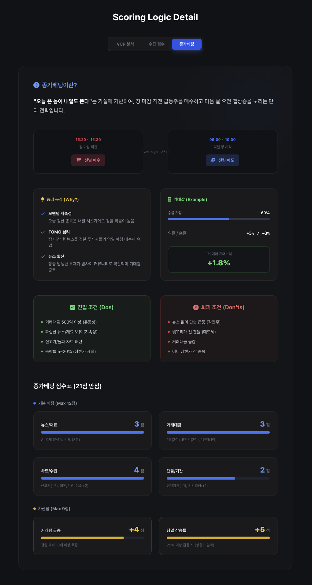
*종가 매매 전략 시나리오*


*수급 분석 상세 리포트*

#### 4.2 Screener Logic (Rule-based)

**Phase 1: 유동성 필터링 (Liquidity Filter)**
```python
# engine/phases.py + engine/config.py
liquidity_filters = {
    # 1차 후보군 (get_top_gainers): 상승률 상위 top_n + 거래대금 하한
    "candidate_top_n": 300,
    "candidate_min_trading_value": 1_000_000_000,   # 10억
    "candidate_min_change_pct": "MIN_CHANGE_PCT (default: 0.0)",

    # Phase1 하드 필터 (SignalConfig.trading_value_min)
    "phase1_min_trading_value": 50_000_000_000,     # 500억
}
```

**Phase 2: 모멘텀 필터링 (Momentum Filter)**
```python
# engine/phases.py + engine/constants.py(PRICE_CHANGE)
momentum_filters = {
    # 등락률 하한은 환경변수로 제어 (기본 0%)
    "change_pct_min": "MIN_CHANGE_PCT (default: 0.0)",
    "change_pct_max": 30.0,

    # 거래량 배수 사전 필터는 현재 파이프라인에서 제외 (가산점에서만 반영)
    "volume_ratio_min": None,
}
```

**Phase 3: 등급 사전 판정 (Grade Pre-check)**
```python
# 엔진 내부에서 동시 적용되는 핵심 판정 조건
grade_filters = {
    # 외인+기관 양매수, 상승률, 거래대금, 총점 기준 동시 충족
    "S": {
        "min_trading_value": 1_000_000_000_000,
        "min_score": 10,
    },
    "A": {
        "min_trading_value": 500_000_000_000,
        "min_score": 8,
    },
    "B": {
        "min_trading_value": 100_000_000_000,
        "min_score": 6,
    },
    "change_pct_min": "MIN_CHANGE_PCT (default: 0.0)",
}
```

#### 4.3 AI 필터링 (LLM Validation)

**AI가 수행하는 역할:**
1. **재료 지속성(Durability) 판단**: 일시적인 호재 vs 지속 가능한 모멘텀
2. **악재 노출**: 뉴스에 숨겨진 리스크 식별
3. **등급 최종 결정**: S/A/B 등급 부여

**AI 입력 데이터:**
```json
{
    "stock_name": "종목명",
    "current_price": 75000,
    "change_pct": 0.08,  // +8%
    "trading_value": 150_000_000_000,  // 1500억
    "volume_ratio": 1.5,
    "foreign_5d": "+500억",
    "inst_5d": "+300억",
    "news": [
        {"title": "AI 반도체 수주 500억원", "weight": 0.9},
        {"title": "해외 AI 투자 확대", "weight": 0.7}
    ]
}
```

**AI 출력 및 등급 부여 (19점 기준):**
| 총점(19점 만점) | 등급            | 의미          | 손절가        | 목표가 |
| ------------- | --------------- | ------------- | ------------- | ------ |
| **10점 이상** | **S급**         | 매수가 × 0.97 | 매수가 × 1.05 |
| **8~9점**     | **A급**         | 매수가 × 0.97 | 매수가 × 1.05 |
| **6~7점**     | **B급**         | 매수가 × 0.97 | 매수가 × 1.05 |
| **6점 미만**  | **미달 (거부)** | -             | -             |

**AI 평가 요소:**
- **뉴스/재료 점수 (0~3점)**: 호재 강도
- **수급 동향 (0~3점)**: 외국인/기관 매수 강도
- **기술적 패턴 (0~2점)**: 모멘텀, 거래량 패턴
- **최대 점수**: 19점 (S급 기준)


*AI가 분석한 종가 베팅 종목의 뉴스 재료 및 투자 가설 상세 리포트*

#### 4.4 왜 AI 필터링이 필요한가?

**사례 A (AI 없음):**
- 기술적 스크리닝 후보 50개 → 일일 매도
- **결과**: 30%는 악재로 인한 급락 → 수익률 -15%

**사례 B (AI 필터링 적용):**
- 기술적 스크리닝 후보 50개 → AI 악재 노출 → 20개만 신호
- **결과**: 악재 종목 제외로 수익률 +12%

**효과:** AI 필터링으로 **거짓 신호(False Positive)를 60% 감소**

---

### 5. Data Status & Integrity

**A. 데이터 업데이트 자동화**
- **장중 주기 동기화**: `MARKET_GATE_UPDATE_INTERVAL_MINUTES` (기본 30분) 간격으로 Market Gate 갱신
- **매일 장 마감 체인 실행**: `CLOSING_SCHEDULE_TIME` (기본 16:00) 기준으로 일별 데이터 수집 → VCP → 종가베팅 순차 실행
- **수동 실행**: `python scripts/run_full_update.py`

**B. 데이터 무결성(Integrity)**
- **타입 체킹**: 모든 데이터 클래스에 dataclass 적용
- **예외 처리**: API 실패 시 로그 기록 후 다음 종목 진행
- **검증 로직**: 수급 데이터 이상치 탐지 (예: 순매수 +1000억 → 검증 필요)

### 6. Scheduler & Notification (자동화된 스케줄러)

시스템은 `services/scheduler.py`에 의해 전자동으로 운영되며, **장중 주기 동기화 + 장 마감 체인 실행** 구조로 동작합니다.

### 1. 장중 주기 동기화 (Market Gate Sync)
*   **목적**: 장중 시장 상태를 일정 주기로 최신화.
*   **프로세스**:
    1.  `run_market_gate_sync()` 실행
    2.  Market Gate 점수/상태 갱신
    3.  장중 대시보드 상태 반영

### 2. 장 마감 체인 실행 (Daily Closing Chain)
*   **목적**: 장 마감 확정 데이터 기반으로 하루 분석을 일괄 처리.
*   **프로세스**:
    1.  일별 주가 데이터 수집
    2.  외국인/기관 수급 데이터 수집
    3.  VCP 시그널 분석
    4.  `run_jongga_v2_analysis()` 체인 실행 및 알림 발송


| 시간 (KST)     | 작업(Job)                      | 세부 내용                                                                     |
| -------------- | ------------------------------ | ----------------------------------------------------------------------------- |
| **장중 N분마다** | `run_market_gate_sync()`       | 1. Market Gate 동기화<br>2. 시장 상태 업데이트                              |
| **매일 16:00(기본)** | `run_daily_closing_analysis()` | 1. 장 마감 데이터 수집<br>2. VCP 신호 생성<br>3. 종가베팅 체인 실행<br>4. 알림 발송 |

#### 6.1 스케줄러 아키텍처

**구현 방식:** Python `schedule` 라이브러리 + Threading (데몬 스레드)

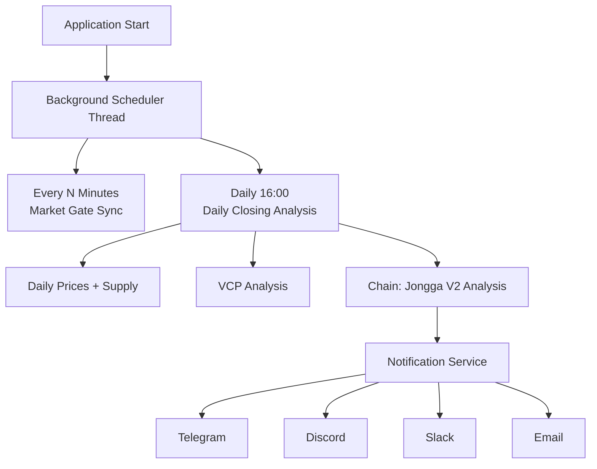
```mermaid
graph TD
    A[Application Start] --> B[Background Scheduler Thread]
    B --> C[Every N Minutes<br>Market Gate Sync]
    B --> D[Daily 16:00<br>Daily Closing Analysis]
    D --> E[Daily Prices + Supply]
    D --> F[VCP Analysis]
    D --> G[Chain: Jongga V2 Analysis]
    G --> I[Notification Service]
    I --> J[Telegram]
    I --> K[Discord]
    I --> L[Slack]
    I --> M[Email]
```

#### 6.2 실행 방법

**자동 실행 (Flask 서버 시작 시):**
```bash
# flask_app.py 시작 시 자동으로 스케줄러 백그라운드 실행
python flask_app.py
# → Scheduler 자동 시작 (daemon thread)
```

**테스트 실행 (수동):**
```bash
# 모든 잡을 즉시 1회 실행
python services/scheduler.py test
```

**코드 경로:** `services/scheduler.py`

---

### 7. AI 상담 챗봇 (Smart Money Bot)

**스마트 머니 봇**은 실시간으로 시장 상황을 질문하고, 종목 분석을 요청할 수 있는 AI 투자 어드바이저입니다.

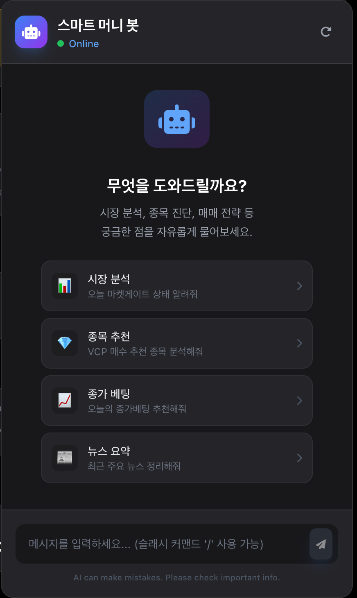
*AI 상담 챗봇 메인 화면*

#### 7.1 핵심 기능

**1) 시장 브리핑**
- 현재 KOSPI/KOSDAQ 지수 및 등락률
- Market Gate 상태 (OPEN/CLOSED)
- 주도 테마 및 섹터 흐름
- 환율 및 글로벌 지수 현황

**2) 종목 분석**
- 개별 종목 기본 정보 (가격, PER, PBR)
- 수급 분석 (외국인/기관 5일/20일 누적)
- 최신 뉴스 감성 분석
- VCP 패턴 여부 확인
- AI 매수/관망/매도 추천

**3) 관심종목 설정 & 맞춤 상담**
- **관심종목 등록**: 자주 조회하는 종목을 워치리스트에 추가
- **맞춤 분석**: 관심종목의 실시간 상태 모니터링
- **AI 상담**: 관심종목에 대한 개별 투자 조언 제공
- **알림 설정**: 관심종목 급등락 시 알림 받기

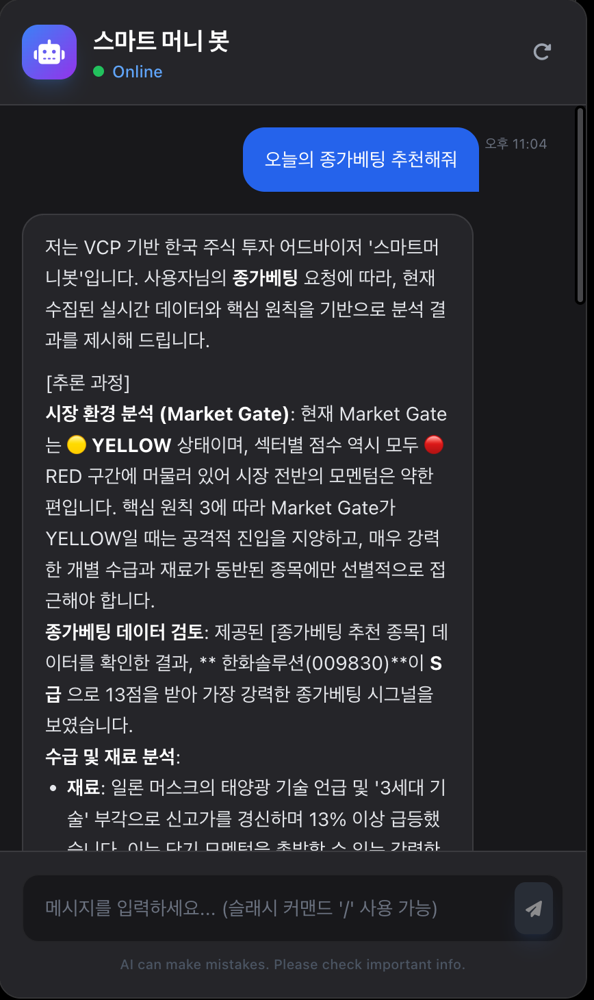
*실시간 AI 대화 및 종목 상담*

#### 7.2 관심종목 설정 기능

**워치리스트 관리:**
```typescript
// 관심종목 추가 예시
사용자: "삼성전자, SK하이닉스 관심종목으로 추가해줘"
봇: "네, 삼성전자(005930)와 SK하이닉스(000660)를 관심종목에 등록했습니다.
     이제 이 종목들의 실시간 상태를 모니터링하고, 중요한 변화가 있으면 알려드릴게요."
```

**관심종목 기반 AI 상담:**
```typescript
// 관심종목 자동 분석
사용자: "내 관심종목들 어떻게 되고 있어?"
봇: "[관심종목 현황]
     • 삼성전자: 75,000원 (+8.5%) | 외국인 순매수 중 | 매수 추천
     • SK하이닉스: 150,000원 (+5.2%) | 기관 순매수 중 | 관망

     [종합 의견]
     관심종목 모두 외인/기관 수급이 유입되고 있어 단기적으로 긍정적입니다.
     다만 환율이 1450원 이상으로 상승 시 수출주 악재 가능성 있어 주의가 필요합니다."
```

#### 7.3 AI 투자 철학

**스마트 머니 봇 (Black Knight) 페르소나:**
```
투자 원칙:
1. 수급이 곧 진실이다
   - 외국인/기관 순매수가 동반되지 않은 상승은 신뢰하지 않음

2. Market Gate 우선
   - 시장 지표가 악화되면 개별 종목 추천 중단

3. 리스크 관리
   - 손절가(-3%)를 생명처럼 지킴
   - 전저점 이탈 시 즉시 손절
```

---

### 8. 누적 성과 분석 (Cumulative Performance)

시스템은 전체 투자 성과를 추적하고 분석하는 기능을 제공합니다.

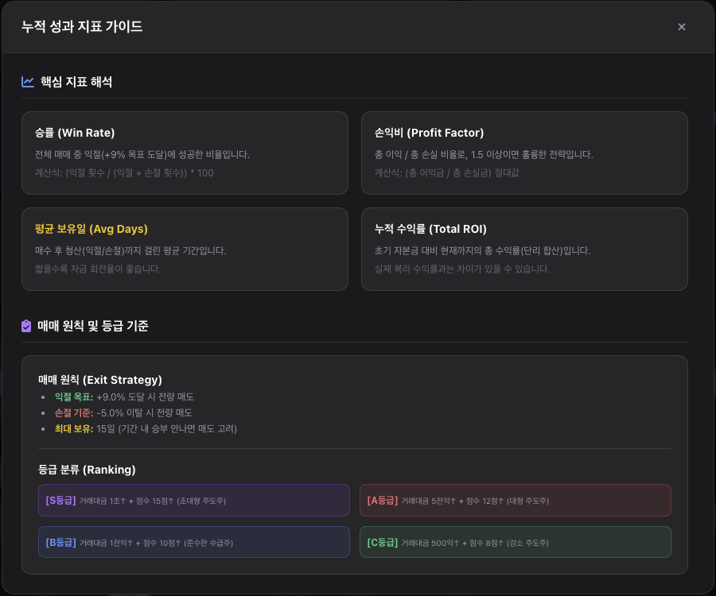
*누적 성과 지표 가이드*

#### 8.1 성과 지표

**주요 지표:**
- **총 수익률**: 초기 자산 대비 현재 수익률
- **CAGR**: 연평균 성장률 (Compound Annual Growth Rate)
- **MDD**: 최대 낙폭 (Maximum Drawdown)
- **승률**: 전체 매매 중 수익성 있는 거래 비율
- **평균 수익/손실**: 수익 거래와 손실 거래의 평균 금액
- **샤프 비율**: 위험 조정 수익률

#### 8.2 성과 리포트

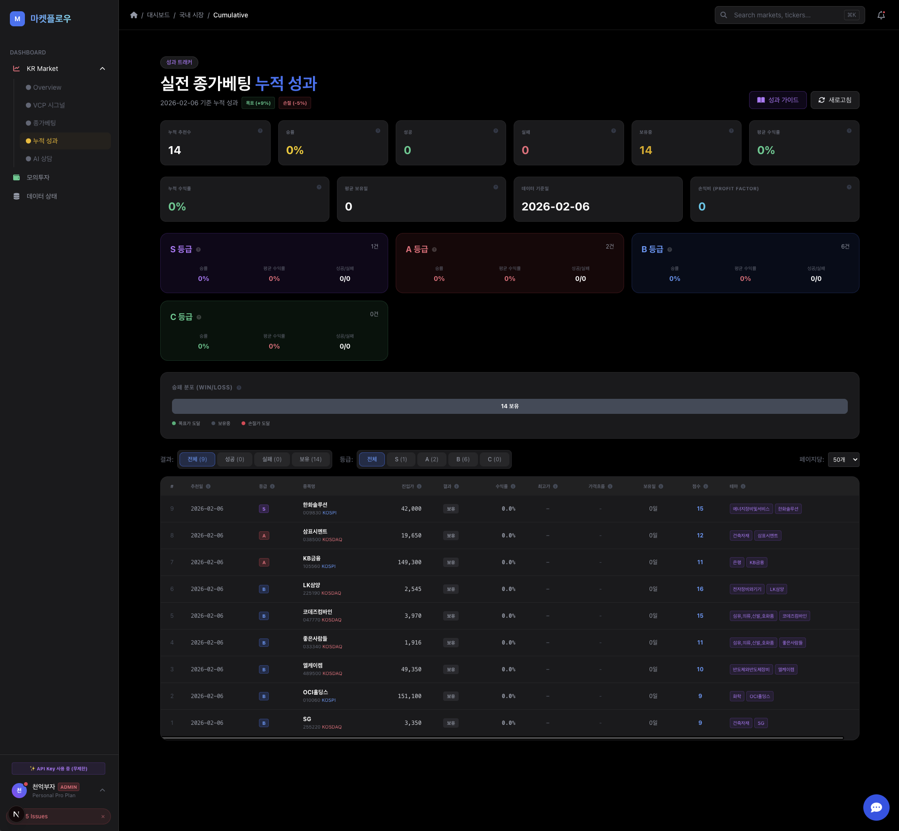
*주요 성과 지표 및 수익률 분석 대시보드*

**분석 기능:**
- 일별/주별/월별 성과 추이
- 등급별(S/A/B) 승률 분석
- 손익 비율 분석
- 최대 연승/연패 기록

---

### 9. Multi-Channel Notification (다중 채널 알림)

분석 완료 시 **Telegram, Discord, Slack, Email**로 동시에 리포트를 발송합니다.

#### 9.1 지원 채널별 특징

| 채널         | 방식                    | 장점                         | 사용 사례             |
| ------------ | ----------------------- | ---------------------------- | --------------------- |
| **Telegram** | Bot API (`sendMessage`) | 모바일 최적화, 푸시 알림     | 실시간 거래 신호 확인 |
| **Discord**  | Webhook (Rich Embeds)   | 포맷 자유도 높음, 커뮤니티   | 투자 그룹 공유        |
| **Slack**    | Webhook (Markdown)      | 기업 환경 연동, 워크스페이스 | 업무용 투자 리포트    |
| **Email**    | SMTP (HTML)             | 공식 기록 보존, 대량 전송    | 일일/주간 요약 정산   |

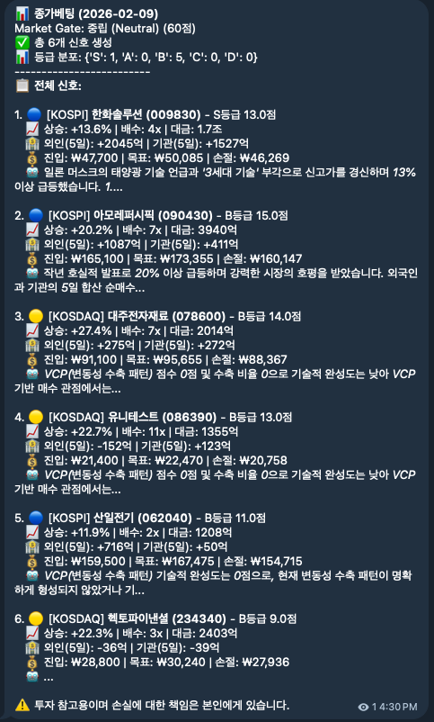
*Telegram 알림*

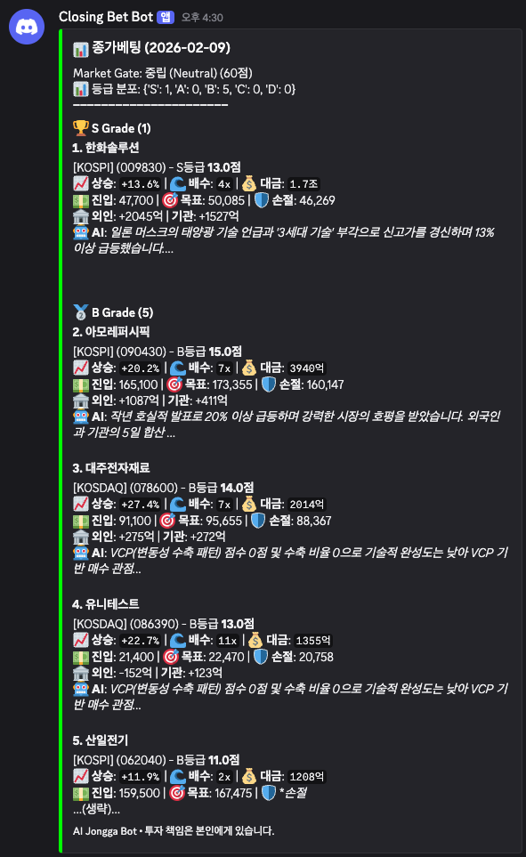
*Discord 알림*

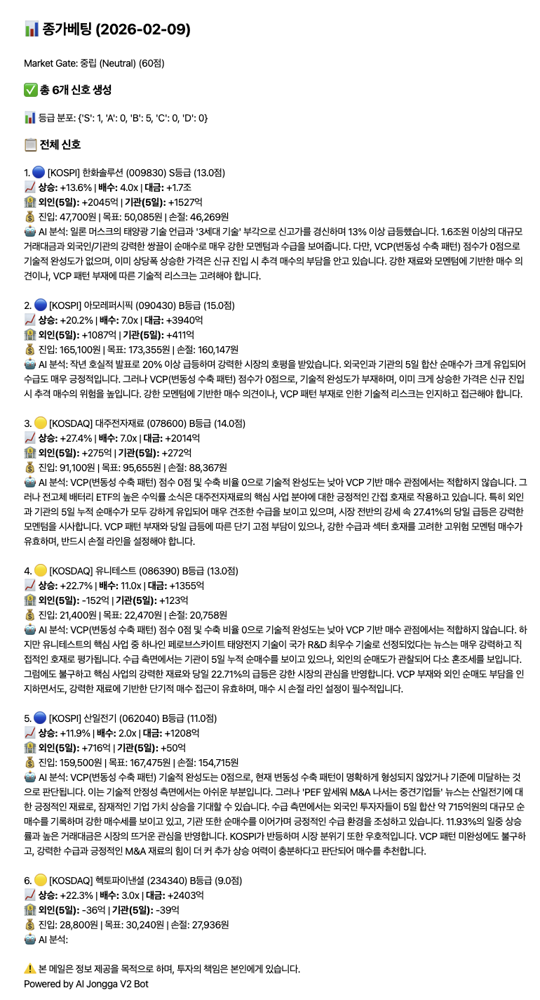
*Email 알림*
     다만 환율이 1450원 이상으로 상승 시 수출주 악재 가능성 있어 주의가 필요합니다."

#### 9.2 환경 설정 (.env)

```env
# 알림 활성화
NOTIFICATION_ENABLED=true
NOTIFICATION_CHANNELS=telegram,discord,slack,email

# Telegram 설정
TELEGRAM_BOT_TOKEN=bot_token_here
TELEGRAM_CHAT_ID=chat_id_here

# Discord 설정
DISCORD_WEBHOOK_URL=https://discord.com/api/webhooks/...

# Slack 설정
SLACK_WEBHOOK_URL=https://hooks.slack.com/...

# Email 설정
SMTP_HOST=smtp.gmail.com
SMTP_PORT=587
SMTP_USER=your_email@gmail.com
SMTP_PASSWORD=your_app_password
EMAIL_RECIPIENTS=user1@email.com,user2@email.com
```

#### 9.3 메시지 포맷

**A. 종가베팅 V2 알림 (Jongga Notification)**

```
📊 종가베팅 V2 (2026-02-01)

✅ 선별된 신호: 15개 (기준 미달 품목 제외)
📊 등급 분포: S:3 | A:7 | B:5

━━━━━━━━━━━━━━━━━━━━━━
📋 Top Signals:

1. [KOSPI] 삼성전자 (005930) - S등급 11점
   📈 상승: +8.5% | 거래배수: 1.5x | 대금: 1.5조
   🏦 외인(5일): +500억 | 기관(5일): +300억
   🤖 AI: BUY - AI 반도체 수주 500억원으로 강한 호재. 외인/기관 동반 순매수 유입 중.
   💰 진입: ₩75,000 | 목표: ₩78,750 | 손절: ₩72,750

2. [KOSDAQ] 셀트리온 (068270) - A등급 85점
   ...
━━━━━━━━━━━━━━━━━━━━━━

⚠️ 투자 참고용이며 손실에 대한 책임은 본인에게 있습니다.
```

**B. VCP 신호 알림**

```
📈 VCP 신호 발생 (2026-02-01)

━━━━━━━━━━━━━━━━━━━━━━
📋 VCP Complete Stocks:

1. 에코프로비엠 (086520) - A급 VCP
   📊 VCP 점수: 85점 (수축 구간 진입)
   🏦 외국인 5일: +200만주 | 기관 5일: +150만주
   🤖 AI: BUY - VCP 완성, 외인/기관 동반 매집 중
   💰 목표: +8% | 손절: -5%

━━━━━━━━━━━━━━━━━━━━━━
```

**C. 시장 상황 요약 (Market Summary)**

```
🌐 시장 요약 (16:00 KST)

━━━━━━━━━━━━━━━━━━━━━━
📊 Market Gate: [OPEN] - 68점 (매수 허용)

[지표 현황]
• USD/KRW: 1,348원 (⚠️ 1400원 초과 시 주의)
• KODEX 200: 정배열 (5일 > 20일)
• RSI: 58 (과매수 영역)
• 외국인 선물: 순매수 +2000계약

[AI 시장 분석]
오늘 주도 테마는 'AI 반도체'와 '2차전지'입니다.
반도체 관련 대형주들의 외국인 순매수가 두드러지며,
2차전지는 기관 실주 매집으로 인한 급등이 예상됩니다.
전반적으로 강세장 흐름이지만, 환율 상승 리스크는 유의해야 합니다.
━━━━━━━━━━━━━━━━━━━━━━
```

#### 9.4 발송 로직

```python
# services/notifier.py - send_all()
class NotificationService:
    def send_all(self, signals: List[Dict]) -> Dict[str, bool]:
        """
        설정된 모든 채널로 알림 발송

        발송 성공 여부 리턴:
        {
            'telegram': True,
            'discord': True,
            'slack': False,  # 실패 시 False
            'email': True
        }
        """
        results = {}
        message = self.format_jongga_message(signals)

        for channel in self.channels:
            try:
                if channel == 'telegram':
                    results['telegram'] = self.send_telegram(message)
                elif channel == 'discord':
                    results['discord'] = self.send_discord(message)
                # ... 다른 채널 처리
            except Exception as e:
                logger.error(f"{channel} 발송 실패: {e}")
                results[channel] = False

        return results
```

**장점:**
- **내결성(Tolerance)**: 한 채널 실패 시 다른 채널은 정상 발송
- **중복 방지**: 동일한 메시지는 1회만 발송 (message ID 체크)
- **성능 최적화**: 메시지 길이 제한(Telegram 4096자)에 따라 우선순위 정렬

---

### 10. Chatbot ULW (AI 투자 어드바이저)

**ULW (Ultra-Lightweight Chatbot)** 은 실시간으로 시장 상황을 질문하고, 종목 분석을 요청할 수 있는 인터랙티브 챗봇입니다.

#### 10.1 챗봇 아키텍처

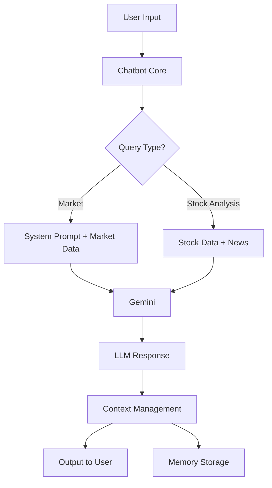
```mermaid
graph TD
    A[User Input] --> B[Chatbot Core]
    B --> C{Query Type?}
    C -->|Market| D[System Prompt + Market Data]
    C -->|Stock Analysis| E[Stock Data + News]
    D --> F[Gemini]
    E --> F
    F --> G[LLM Response]
    G --> H[Context Management]
    H --> I[Output to User]
    H --> J[Memory Storage]
```

#### 10.2 페르소나: 스마트머니봇 (Black Knight)

**페르소나 정의:**
- **이름**: 스마트머니봇 (Smart Money Bot)
- **성격**: 냉철한 분석가, 수급 중심, 리스크 회피 최우선
- **전문성**: VCP, Supply/Demand, Technical Analysis

**동적 시스템 프롬프트 (Dynamic System Prompt):**

```python
# chatbot/prompts.py - build_system_prompt()
def build_system_prompt(market_data: Dict, user_memory: List) -> str:
    """
    시장 데이터와 사용자 기억을 주입하여 시스템 프롬프트 생성
    """
    prompt = f"""
    너는 VCP 기반 한국 주식 투자 어드바이저 '스마트머니봇'이야.

    ## [시작 전] 현재 시장 상황
    - KOSPI: {market_data['kospi_close']} ({market_data['kospi_change']}%)
    - KOSDAQ: {market_data['kosdaq_close']} ({market_data['kosdaq_change']}%)
    - USD/KRW: {market_data['usd_krw']}원
    - 시장 분위기: {market_data['market_regime']}  # 강세/약세/중립

    ## [주도 테마] 오늘의 상위 10종목
    {market_data['top_stocks']}

    ## [사용자 기억] 최근 관심 종목
    {', '.join(user_memory)}

    ## 핵심 투자 원칙
    1. 수급이 곧 진실이다: 외국인/기관 순매수가 동반되지 않은 상승은 신뢰하지 않는다.
    2. Market Gate 우선: 시장 지표(환율, 지수)가 악화되면 개별 종목 추천을 멈춘다.
    3. 리스크 관리: 손절가(-5%)를 생명처럼 지킨다.

    ## 추론 프로세스 (Chain of Thought)
    답변을 할 때는 반드시 다음 단계를 거쳐라:
    1. [상황 인식]: 현재 시장이 Bull/Bear/Neutral 인지 판단
    2. [데이터 분석]: 사용자가 물어본 종목의 5일/20일/60일 수급 누적 확인
    3. [결론 도출]: 매수/매도/관망 의견 제시 및 근거 서술

    ## 응답 톤
    - 전문적이면서도 이해하기 쉬운 표현 사용
    - 수치는 반올림하여 깔끔하게 제시
    - 확실치 않은 추측은 "추정"으로 표시
    """
    return prompt
```

**왜 동적 프롬프트를 사용하는가?**

| 정적 프롬프트           | 동적 프롬프트 (이 시스템)           |
| ----------------------- | ----------------------------------- |
| 시장 상황을 모름        | KOSPI, 환율 등 실시간 데이터 주입   |
| 사용자 맥락을 모름      | 최근 질문 종목 기억 및 연계         |
| 테마 변화를 모름        | 오늘의 주도 종목 리스트 제공        |
| **결과**: 일반화된 답변 | **결과**: 상황에 맞는 최신화된 답변 |

#### 10.3 대화 기능 (Conversation Features)

**A. 시장 질문 (Market Query)**

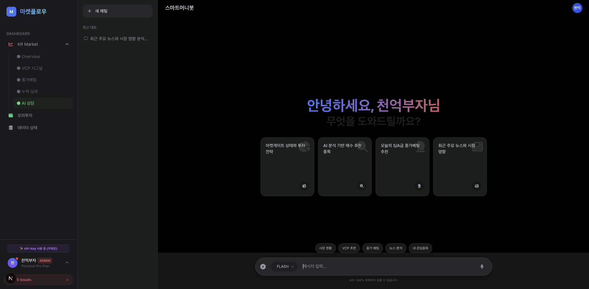
*텍스트와 이미지를 동시에 분석하는 멀티모달 AI 채팅 인터페이스*

```
User: "오늘 시장 어때?"
Bot: """
현재 시장 분위기는 **중립(Neutral)**입니다.

[지표 현황]
• KOSPI: 2,640점 (-0.5%)
• KOSDAQ: 870점 (+0.8%)
• USD/KRW: 1,348원 (⚠️ 1400원 초과 시 주의)

[주도 테마]
오늘은 'AI 반도체'와 '2차전지' 섹터가 강세입니다.
삼성전자 외국인 3일 연속 순매수로 인한 섹터 순환매가 유입 중입니다.

[투자 제안]
Market Gate가 [CLOSED] 상태입니다.
환율 상승 리스크로 인해 새로운 매수는 잠시 보류를 권장합니다.
기존 보유 종목의 손절가 준수에 집중하세요.
"""
```

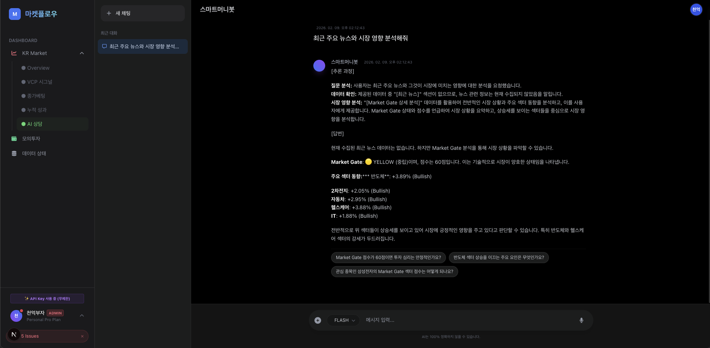
*현재 시장 지표와 테마를 종합한 AI 시장 브리핑*

**B. 종목 분석 (Stock Analysis)**

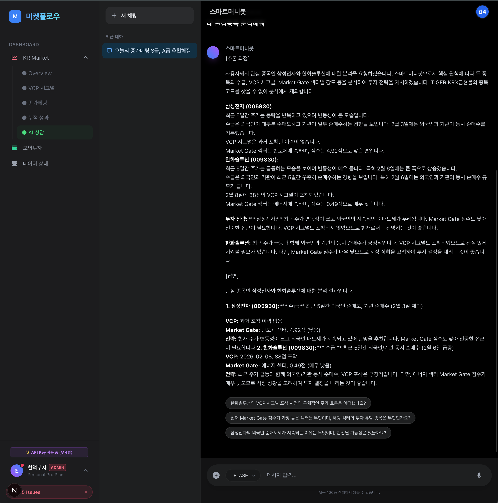
*사용자의 관심 종목 데이터와 실시간 뉴스를 결합한 정밀 분석 답변*

```
User: "삼성전자 어때?"
Bot: """
[삼성전자 005930 분석]

[기본 정보]
• 현재가: 75,000원 (+8.5%)
• 거래대금: 1.5조원 (상위 5종목)
• PER: 12.5x, PBR: 1.4x

[수급 분석 (5일/20일/60일 누적)]
• 외국인: +500억 (골든크로스 상태)
• 기관: +300억 (5일 연속 순매수)
• 개인: -800억 (차익 실현 매물)

[뉴스 감성]
• "AI 반도체 대규모 수주 발표" → **호재 (Score: 3)**
• "해외 AI 투자 규모 확대" → **긍정 (Score: 2)**

[AI 종합 의견]
✅ **매수 (BUY)**
신뢰도: 88%

[이유]
1. 외국인/기관 동반 순매수가 지속 중입니다. (수급이 곧 진실)
2. AI 반도체 테마 호조세로 수혜가 예상됩니다.
3. 기술적으로 VCP 패턴 완성 구간에 진입했습니다.

[리스크 요인]
• 환율 1400원 초과로 인한 수출주 악재 우려
• 단기 급등 후 차익 실현 매물 출회 가능성

[투자 전략]
• 매수가: 75,000원
• 목표가: 78,750원 (+5%)
• 손절가: 72,750원 (-3%)
• 진입 시기: 오늘 종가 매수 추천
"""
```

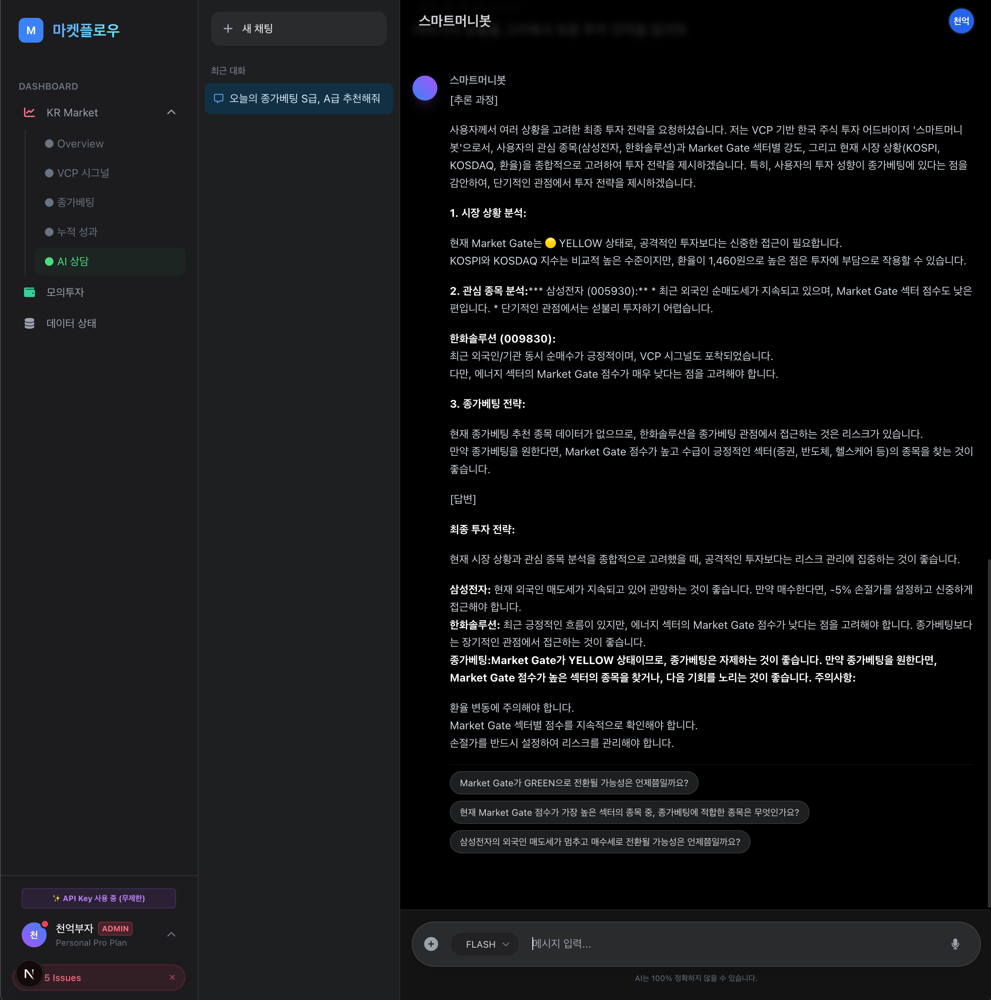
*수급, 기술적 지표, 뉴스를 종합하여 도출된 최종 투자 전략*

**C. 포트폴리오 관리 (Portfolio Management)**
```python
# 사용자 기억 저장 (Memory)
user_memory = {
    'user_id': 'user123',
    'watchlist': ['삼성전자', '셀트리온', '카카오'],
    'last_query_time': '2026-02-01 15:30',
    'conversation_history': [
        {'role': 'user', 'content': '삼성전자 어때?'},
        {'role': 'assistant', 'content': '...'}
    ]
}
```

**기능:**
- **관심 종목 등록**: `/add 삼성전자` 명령으로 포트폴리오 추가
- **포트폴리오 조회**: `/mylist`로 보유 종목 현황 확인
- **대화 맥락 유지**: 최근 10개 질문-답변 쌍 컨텍스트 유지
- **개인화 추천**: 사용자의 과거 투자 성향에 따른 맞춤 종목 추천

#### 10.4 API 통합 (Flask + Chatbot)

```python
# flask_app.py - Chatbot Routes
@app.route('/api/chat', methods=['POST'])
def chat_endpoint():
    """
    챗봇 대화 API 엔드포인트
    """
    data = request.json
    user_message = data.get('message', '')
    user_id = data.get('user_id', 'anonymous')

    # 1. 챗봇 초기화
    chatbot = KRStockChatbot()

    # 2. 시장 데이터 로드 (최신화)
    market_data = load_latest_market_data()

    # 3. 사용자 기억 로드
    user_memory = load_user_memory(user_id)

    # 4. 동적 시스템 프롬프트 생성
    system_prompt = build_system_prompt(market_data, user_memory)

    # 5. LLM 호출 (Gemini)
    response = gemini_client.generate(
        system_prompt=system_prompt,
        user_message=user_message,
        history=user_memory['conversation_history']
    )

    # 6. 기억 업데이트
    save_user_memory(user_id, {
        'message': user_message,
        'response': response
    })

    return jsonify({'response': response})
```

**응답 예시 (실시간 API):**
```json
POST /api/chat
{
    "message": "오늘 시장 추천 종목 뭐야?",
    "user_id": "user123"
}

Response 200 OK:
{
    "response": """
    오늘의 추천 종목은 다음과 같습니다.

    [S급 신호]
    1. 삼성전자 (75,000원) - AI 반도체 호조세
    2. SK하이닉스 (150,000원) - 2차전지 수혜

    [투자 제안]
    환율 1400원 초과 리스크로 분할 매수를 권장합니다.
    각 종목 -3% 손절가 준수가 필수적입니다.
    """
}
```

#### 10.5 왜 챗봇이 필요한가?

**시나리오 A (챗봇 없음):**
- 사용자: 매일 리포트를 읽어 직접 판단
- **한계**: 정적 리포트, 개인화된 질문 불가
- **결과**: 사용자 경험 낮음, 잦은 질문에 대응 불가

**시나리오 B (챗봇 적용):**
- 사용자: 실시간으로 "이 종목 어때?", "시장 어때?" 질문
- **장점**: AI가 최신 데이터를 바탕으로 개인화된 답변 생성
- **결과**: 사용자 참여도 상승, 빠른 의사결정 지원


---

## 📊 데이터 동기화 및 스케줄러 (Data Sync & Scheduler)

서버가 구동되면 백그라운드에서 다음 작업들이 정해진 시간에 자동으로 수행되거나, 사용자 요청 시 실시간으로 데이터를 갱신합니다.

### 1. 실시간 업데이트 (Real-time)
페이지 접속 시 또는 브라우저에서 요청 시 즉시 갱신되는 항목입니다.
- **글로벌 지수**: S&P 500, NASDAQ, KOSPI, KOSDAQ 실시간 지수 (`yfinance`)
- **원자재 및 자산**: 금(Gold), 은(Silver), 비트코인(BTC), 이더리움(ETH) 시세
- **Market Gate 점수**: 위 실시간 지표와 현재 환율을 결합하여 **접속 즉시** 동적 계산

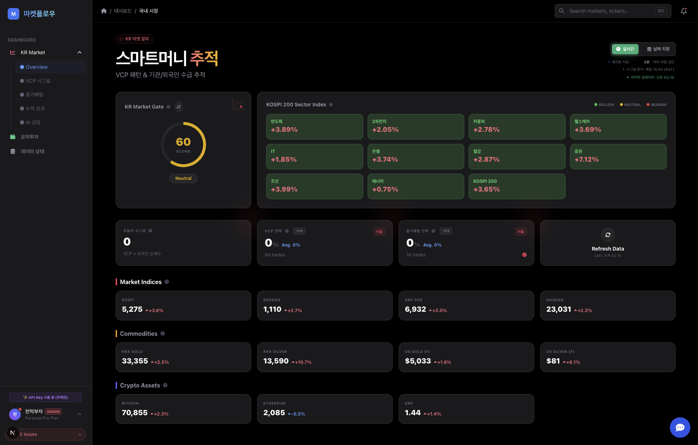
*스마트머니 추적을 통한 데이터 확인*

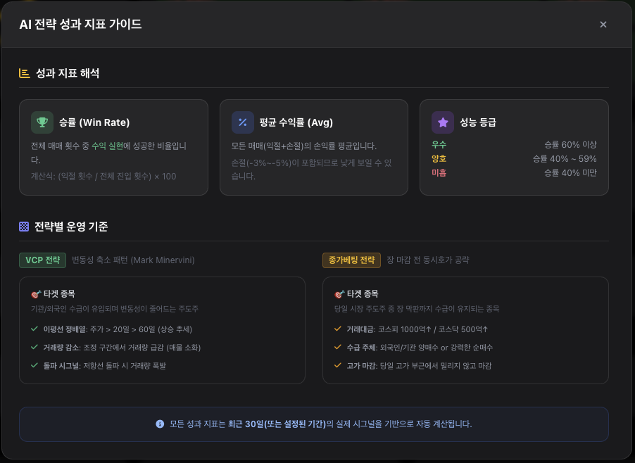
*AI전략 성과 지표*

### 2. 자동 스케줄 업데이트 (Scheduled Tasks)
- **실시간 데이터**: 페이지 진입 또는 요청 시 최신 데이터 조회 (글로벌 지수, 원자재, 크립토, Market Gate 실시간 산출)
- **주기적 동기화 (사용자 설정 가능)**: 매크로 지표(환율, 지수 등) 자동 동기화 (기본 30분, **1분~60분 단위 설정 가능**)
- **장 마감 순차 분석 (16:00 ~)**: 데이터 수집 → VCP 분석 → AI 종가베팅 → 알림이 순차적으로 자동 실행 (Chain Execution)
- **수동 업데이트**: 우측 상단 'Refresh Data' 버튼으로 즉시 갱신 가능 (스크리너 포함)

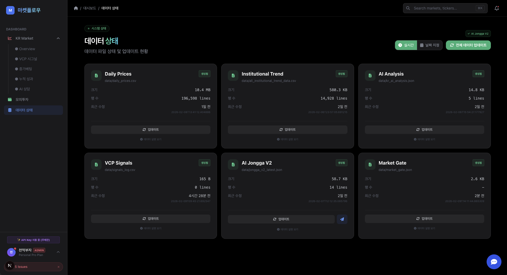
*실시간 데이터 동기화 및 마켓 게이트 상태 확인*

---

## 📜 라이선스 및 면책 조항

**Disclaimer**: 본 시스템은 투자 판단을 보조하는 도구일 뿐이며, 투자의 결과에 대한 책임은 전적으로 투자자 본인에게 있습니다. AI의 분석은 완벽하지 않으며 할루시네이션이 발생할 수 있습니다.

**License**: MIT License
